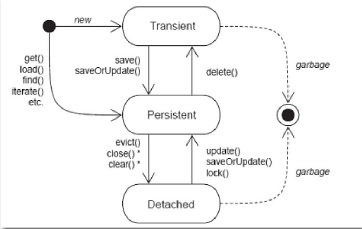

# HIBERNATE

### 简介

Hibernate 是一个开放源代码的 ORM 框架，对 JDBC 进行了轻量级的对象封装，是 Java 持久层框架之一

### 目录结构

documentation: 存放 Hibernate 的相关文档

lib: 存放 Hibernate 编译运行所需要的 jar 包，required 子目录下包含了运行 Hibernate 项目必须的 jar 包

project: 存放 Hibernate 相关的源代码

### 使用入门

创建实体对象

```java
//JavaBean 对象
public class User {
    //私有化属性
    private int id;
    private String name;
    private String password;
    //空参构造
    public User(){}
    //getter setter 方法
    public int getId(){return id;}
    public void setId(int id) {this.id = id;}
    public String getName() {return name;}
    public void setName(String name) {this.name = name;}
    public String getPassword() {return password;}
    public void setPassword(String password) {this.password = password;}
}
```


创建表

```sql
create table user{
	id int primary key auto_increment,
	name varchar(255),
	password varchar(255)
}
```


引入 Hibernate 开发包，数据库驱动包

创建映射文件 user.hbm.xml

```xml
<?xml version="1.0" encoding="utf-8"?>
<hibernate-mapping package="com.project.domain">
    <class name="User" table="user">
    	<id name="id" column="id">
            <generator class="native"></generator>
        </id>
        <property name="name" column="name"/>
        <property name="passowrd" column="password"/>
    </class>
</hibernate-mapping>
```


创建 Hibernate 核心配置文件 hibernate.cfg.xml

```xml
<?xml version="1.0" encoding="utf-8"?>
<hibernate-configuration>
    <session-factory>
        <!-- 必要配置信息5个 -->
    	<propertory name="hibernate.connection.driver_class">com.mysql.jdbc.Driver</propertory>
        ...
        <property name="hibernate.dialect">org.hibernate.dialect.MySQLDialect</property>
        <!-- 可选属性3个 -->
        <property name="hibernate.show_sql">true</property>
        <property name="hibernate.format_sql">true</property>
        <!-- create-drop create update validate -->
        <property name="hibernate.hbm2ddl.auto">update</proprerty>
        <!-- 加载映射 -->
        <mapping resource="com/project/domain/user.hbm.xml"/>
    </session-factory>
</hibernate-configuration>
```


编写测试代码

```java
public class TestHbm {
    public void test(){
        //创建配置对象
        Configuration cf = new Configuration();
        //加载配置文件
        cf.configure();
        //创建session工厂对象
        SessionFactory sf = cf.buildSessionFactory();
        //开启Session
        //Session session = sf.getCurrentSession();
        Session session = sf.openSession();
        //session对象可开启事务，执行增删改查
        Transaction tx = session.beginTransaction();
        //Transaction tx = session.getTransaction();
        //tx.begin();
        User u = new User();
        u.setName("zhangsan");
        //插入数据
        session.save(u);
        //session.update();
        //session.delete();
        //session.get();
        //提交事务
        tx.commit();
        //关闭 session
        session.close();
    }
}
```


### 配置文件

##### 元数据

###### class 标签：建立类和表的映射

name 属性：类全路径

table 属性：表明

catalog 属性：数据库名，一般省略

###### id 标签：建立类属性与表主键的关联

name：类属性名

column：表字段名

length：字段长度

type：字段类型	Java 类型，Hibernate 类型，SQL 类型

###### property 标签：建立普通属性与表字段的关联

##### 核心配置

5 个必需属性

3 个可选属性

加载映射关系

### 相关 API

###### Configuration

用于加载 Hibernate 核心配置文件，对象映射文件，此对象只存在于系统初始化阶段，将 SessionFactory 创建完成后，不再使用

###### SessionFactory

此接口负责 Hibernate 的初始化和建立 Session 对象，具有缓冲区作用

SessionFactory 特点：

> 线程安全，同一个实例可以多个线程共享
>
> 不能随意创建和销毁它的实例

一个项目中一般只需要一个 SessionFactory，可通过抽取工具类使用静态块初始化来获得它

###### Session

Session 是应用程序和数据库交互的单线程对象（好比 Hibernate 与 database 的会话），提供数据库的增删改查，它不是线程安全的

> save()、update()、saveOrUpdate(): 增加修改对象
>
> delete(): 删除对象
>
> get()、load(): 根据主键查询(OID)
>
> createQuery()、createCriteria()、createSQLQuery(): 数据库操作对象(HQL、QBC、SQL)

###### Transaction

Hibernate 的数据库事务接口，可进行事务管理

### 持久化类编写规则

- 提供无参构造方法

  Hibernate 底层使用反射生成类的实例

- 属性私有，提供 get、set 方法

  Hibernate 底层会将查询到的数据进行封装，只有提供了 get、set 方法的成员变量的才叫做属性

- 属性尽量使用包装类型

  包装类型和基本类型的默认值不同，包装类型可以使用 null 来描述空值，而基本类型使用 0 描述，具有多层含义

- 持久化类要有一个唯一标识与表的主键对应

  Hibernate 通过这个唯一标识区分内存中是否是同一个持久化类

- 持久化类尽量不要使用 final 进行修饰

  Hibernate 的延迟加载机制（一种优化手段）会产生代理对象，而产生代理对象使用的是字节码的增强技术完成的，即产生当前类的一个子类对象实现，final 修饰的类无法继承

### 主键生成策略

##### 主键类型

自然主键

把具有业务含义的字段作为主键。当业务中的字段满足主键规则时，例如身份证号，可以直接将其作为标的主键

代理主键

把不具有业务含义的字段作为主键，例如 ID

##### 主键生成策略

incremet：由 Hibernate 进行维护，获取到表中主键的最大值再加 1 ，具有线程安全问题

identity：使用数据库本身提供的主键生成标识符

hilo：由 Hibernate 维护，使用高低位算法（数据库本身采用的主键算法）生成主键，数据库既不支持自增也不支持序列时使用，但实际不存在这种数据库

sequence：根据底层数据库序列生成标识符，需要数据库支持序列，Oracle 的主键生成策略

native：根据底层数据库对自动生成标识符的能力自动选择 identity、sequence、hilo 中的一种

uuid：Hibernate 采用 128 位的 UUID 算法生成主键

assigned：由程序负责生成主键，默认的主键生成策略，一般用于自然主键

### 持久化对象的三种状态

##### 瞬时状态

没有 id，不存在于 session 缓冲中，使用 new 创建的对象就处于游离态

##### 持久状态

有 id，存在于 session 缓存中，并且关联 session 未关闭，在数据库中有对应的记录，持久态对象在事务未提交前变成持久态

##### 游离状态

当持久化状态的实例与 session 关联被关闭时就变成游离态，持久态有 id，不存在于 session 缓存中，与数据库中的数据存在关联，只是失去了与当前 session 的关联

##### 状态转换



瞬时态转换到其他状态

持久态转换到其他状态

脱管态转换到其他状态

##### 持久态对象自动更新数据库

持久化对象可以自动更新数据库，例如通过 get() 获得一个对象后，更改其某个属性，在未调用 update() 时，数据库中的数据就已经发生更改，此过程依赖 Hibernate 的一级缓存

### 一级缓存

缓存通过降低程序直接读写永久性数据存储源的频率，提高应用的运行性能，Hibernate 中具有一级缓存和二级缓存，它们均位于持久层

Hibernate 的一级缓存指 session 缓存，它是一块内存空间，用来存放相互管理的 Java 对象，它能够减少对数据库的访问次数

> 执行 session 接口的 save()、update()、saveOrUpdate() 方法时，如果 session 中没有相应的对象，Hibernate 会自动的把从数据库查询到的相应对象信息加入到一级缓存
>
> 执行 session 接口的 load()、get()，或 Query 接口的 list()、iterator() 方法时，会判断缓存中是否存在该对象，有则返回，没有则从数据库查询，并添加到一级缓存
>
> 执行 session 接口的 close() 方法时，session 缓存会被清空

##### 快照区

Hibernate 向一级缓存放入数据时，会同时复制一份数据放入到快照区中，当使用 commit() 提交事务时，同时会清理 session 的一级缓存，此时会判断一级缓存中的对象和快照中的对象是否一致，不一致则更新数据库，所以快照可以保证一级缓存中的数据和数据库保持一致

### 事务

##### 事务特性

Atomic、Consistency、Isolation、Durability

##### 并发问题

脏读：读取到其他事务未提交的数据

不可重复读：事务执行中，其它事务更新了数据，导致两次读取的数据不一致

虚读（幻读）：事务执行中，其它事务插入了数据，导致两次读取数据总数不一致

##### 隔离级别

读未提交、读已提交、可重复读、串行化

> MySQL 具有四种隔离级别，默认隔离级别为 REPEATABLE_READ
>
> Oracle 具有三种隔离级别，没有可重复读，默认隔离级别 READ_COMMITTED
>
> ##### Hibernate 操作事务
>
> ```java
> //开启事务
> Transaction tx = session.beginTransaction();
> //提交事务
> tx.commit();
> //回滚事务
> tx.rollback();
> ```

hibernate可通过配置文件设置事务隔离级别

```xml
<session-factory>
    <!-- 隔离级别 1248 -->
    <property name="hibernate.connection.isolation">4</property>
</session-factory>
```

事务应用场景：通常事务控制在 service 层实现，并且在 service 中调用多个 dao 实现一个业务逻辑的操作，这样做需要保证事务中使用的 session 和多个 dao 调用的 session 一致，具有两种实现方式：1.在业务层获取到 session，并将 session 作为参数传递给 dao；2.使用 ThreadLocal 将业务层获取的 session 绑定到当前线程，在 dao 层通过当前线程获取	

Hibernate 提供了三种管理 session 对象的方法，可在配置文件中进行配置：

```xml
<!-- session 对象的生命周期与本地线程绑定 -->
<property name="hibernate.current_session_context_class">thread</property>
<!-- session 对象的生命周期与 JTA 事务绑定 -->
<property name="hibernate.current_session_context_class">jta</property>
<!-- Hibernate 委托程序管理 session 对象的生命周期 -->
<property name="hibernate.current_session_context_class">managed</property>

```

Hibernate 中通过 getCurrentSession() 方法可创建一个和 ThreadLocal 绑定的 session 对象，此方法获得的 session 可以不用关闭，当线程执行结束后，自动关闭

### HQL 查询

HQL 是 hibernate 的查询语句，它是完全面向对象的，语法与 SQL 类似

```java
//编写HQL语句，使用类名、类属性
String HQL1 = "select * from Customer";
String HQL2 = "from Customer where name = ?";
String HQL3 = "from Customer where name = :aaa and age = :bbb";
//获得Query对象
Query query = session.createQuery("from Customer");
//设置参数，索引从0开始
query.setString(0,"zhangsan");
query.setString("aaa","zhangsan");
//分页查询
query.setFirstResult(0);
query.setMaxResult(3);
//执行查询
List<Customer> list = query.list();
//query.setter 设置查询语句的参数
//query.iterator() 将查询结果返回为一个Iterator对象
//query.uniqueResult() 返回唯一的结果，确保只有一条记录的查询时使用
```

### Criteria 查询

无语句查询，完全面向对象的可扩展的条件查询，是 Hibernate 的核心查询对象

```java
//获得Criteria对象
Criteria criteria = session.createCriteria(Customer.class);
//添加查询条件
criteria.add(Restrictions.eq("name","zhangsan"));
criteria.add(Restrictions.eq("age",18));
//分页查询
criteria.setFirstResult(0);
criteria.setMaxResult(3);
//执行查询
List<Customer> list = criteria.list();
Customer c = criteria.uniqueResult();
```

### SQLQuery

此接口接收 sql 语句进行查询，调用 llist() 或 uniqueResult() 执行查询，sql 语句的查询结果不会直接封装到实体对象

```java
//获得SQLQuery对象
SQLQuery sqlQuery = session.createSQLQuery("select * from customer");
//执行查询，结果不会封装到实体对象
List<Object[]> list = sqlQuery.list();
//告知程序将实体封装到对象
sqlQuery.addEntity(Customer.class);
List<Customer> list = sqlQuery.list();
```

### 表关系：一对多

##### 表关系表达

在多的一方使用外键指向一的一方的主键

```sql
create table catagory(
    c_id int  not null primary key auto_increment,
    c_name varchar(255) not null
);
```

```sql
create table product(
    p_id int not null primary key auto_increment,
    p_name varchar(255) not null,
    p_c_id int,
    foreign key(p_c_id) references catagory(c_id)
);
```

##### 实体关系表达

在多的一方的类中持有对一的一方的引用，在一的一方使用集合引用多的一方

```java
public class Catagory {
    private Long c_id;
    private String c_name;
    //使用集合引用多的一方
    private Set<Product> products;
}
```

```java
public class Product {
    private Long p_id;
    private String p_name;
    //持有一的一方引用
    private Catagory catagory;
}
```

##### 创建映射

Catagory.hbm.xml

```xml
<?xml version="1.0" encoding="utf-8"?>
<hibernate-mapping package="com.project.domain">
	<class name="Catagory" table="catagory">
    	<id name="c_id" column="c_id">
            <generator class="identity"></generator>
        </id>
        <property name="c_name" column="c_name"/>
        <set name="products">
            <!-- 对应的外键 -->
            <key column="p_c_id"></key>
            <one-to-many class="com.project.domain.Product"/>
        </set>
    </class>
</hibernate-mapping>
```

Product.hbm.xml

```xml
<?xml version="1.0" encoding="utf-8"?>
<hibernate-mapping package="com.project.domain">
	<class name="Product" table="product">
    	<id name="p_id" column="p_id">
            <generator class="identity"></generator>
        </id>
        <property name="p_name" column="p_name"/>
        <many-to-one name="catagory" column="p_c_id" class="com.project.domain.Catagory"/>
    </class>
</hibernate-mapping>
```

##### 保存实例

```java
public void save() {
    Configuration cf = new Configuration().config();
    Session session = cf.buildSessionFactory().openSession();
    Transaction tx = session.beginTransaction();
    //创建一个商品类，两个商品
    Catagory c = new Catagory;
    c.setName("手机数码");
    Product p1 = new Product();
    p1.setName("华为 Nova");
    Product p2 = new Product();
    p2.setName("小米8");
    //双向关联
    //商品类关联商品
    c.getProducts.add(p1);
    c.getProducts.add(p2);
    //商品关联商品类
    p1.setCatagory(c);
    p2.setCatagory(c);
    //执行保存
    session.save(c);
    session.save(p1);
    session.save(p2);
    tx.commit;
    session.close;
}
```

##### 级联

在操作对象时，必须双向关联才能成功操作对象，如果保存时仅保存商品类别，会导致持久状态的对象关联了瞬时态的对象，导致无法成功保存，通过 Hibernate 的级联操作可以解决此问题

级联操作是指当主控方执行保存、更新和删除操作时，其关联对象也执行相同的操作。级联操作具有方向性，可以一的一方级联多的一方或多的一方级联一的一方。通过配置 cascade 属性可以使用级联，使用级联必须建立关系

###### 级联保存更新

```xml
<!-- cascade属性：save-update	delete	all-->
<!-- 设置级联保存和更新，保存更新商品类别时级联保存更新商品 -->
<set name="products" cascade="save-update">
    <!-- 对应的外键 -->
    <key column="p_c_id"></key>
    <one-to-many class="com.project.domain.Product"/>
</set>
```

```xml
<!-- 设置级联保存和更新，保存更新商品时级联保存更新商品类别 -->
<many-to-one name="catagory" column="p_c_id" class="com.project.domain.Catagory" cascade="save-update"/>
```

###### 级联删除

在 JDBC 操作中，如果两张表具有外键关系，则无法直接删除被外键引用的数据。在 Hibernate 中，可以直接删除数据，外键关系会被置为 null

使用级联删除时，会直接删除数据，并将所有外键关联的数据均直接删除

##### 双向关联产生冗余 SQL

在双向维护关系时，外键更新语句会执行两次，这样会导致产生多余的 SQL 语句。通过将一方放弃外键维护权，可去掉冗余 SQL 语句，通常是一的一方放弃维护。通过 inverse 属性进行配置

```xml
<!-- inverse 默认值为 false，表示默认要维护关系 -->
<set name="products" inverse="true">
    <key column="p_c_id"></key>
    <one-to-many  class="com.project.domain.Product"/>
</set>
```

### 表关系：多对多

##### 表关系表达

引入一张新表，设置两个外键分别指向两张多表的主键

##### 实体关系表达

类中均使用集合存储对另一方的引用

##### 映射关系

Student.hbm.xml

```xml
<set name="teachers" table="middleTable">
    <key column="s_id"></key>
    <many-to-many class="com.project.domain.Teacher" column="t_id">
</set>
```

Teacher.hbm.xml

```xml
<set name="students" table="middleTable">
    <key column="t_id"></key>
    <many-to-many class="com.project.domain.Student" column="s_id">
</set>
```

##### 保存实例

```java
public void save() {
    Student s1 = new Student();
    s1.setName("zhangsan");
    Student s2 = new Student();
    s2.setName("lisi");
    Teacher t1 = new Teacher();
    t1.setName("teacher zhang");
    Teacher t2 = new Teacher();
    t2.setName("teacher li");
    //如果多对多建立了双向关联，一定要有一方放弃外键维护权
    s1.getTeachers().add(t1);
    s1.getTeachers().add(t2);
    s2.getTeachers().add(t1);
    s2.getTeachers().add(t2);
    
    t1.getStudents().add(s1);
    t1.getStudents().add(s2);
    t2.getStudents().add(s1);
    t2.getStudents().add(s2);
    
    session.save(s1);
    session.save(s2);
    session.save(t1);
    session.save(t2);
}
```

在多对多的保存中，如果进行了双向维护关系，就必须有一方放弃外键维护，一般由被动方放弃，主动方进行维护。如果只进行了单向维护关系，则不需要放弃外键维护

##### 级联

###### 级联保存更新

在主控方配置 cascade 属性为 save-update 即可

###### 级联删除

在主控方配置 cascade 属性为 delete 即可。一般不会在多对多关系中使用级联删除

##### 常用操作

###### 学生删除已选课程

```java
public void delete() {
    Transaction tx = session.beginTransaction();
    //获得要删除课程的学生，持久态
    Student s = session.get(Student.class,1L);
    //获得学生要删除的课程，持久态
    Course c = session.get(Course.class,1L);
    //解除关系，即学生移除课程
    s.getCourses().remove(c);
    //处于持久态，事务提交时自动保存到数据库
    tx.commit();
}
```

###### 学生改选课程

```java
public void change() {
    Transaction tx = session.beginTransaction();
    //获得要更改课程的学生
    Student s = session.get(Student.class,1L);
    //获得要更改的课程
    Course c1 = session.get(Course.class,1L);
    //获得更改后的课程
    Course c2 = session.get(Course.class,2L);
    //解除和添加关系
    s.getCourses().remove(c1);
    s.getCourses().add(c2);
    //均处于持久态，提交事务时自动保存到数据库
    tx.commit();
}
```

### Hibernate 检索方式

##### 对象图导航检索

根据已加载的对象，导航到其关联对象，即利用类与类之间的关系来检索对象，使用此方式必须在对象关系映射文件上配置关联关系

```java
Product p = session.get(Product.class, 1L);
//通过商品对象获得商品类别对象
Catagory c = p.getCatagory();
```

##### OID 检索

使用 session 的 get()、load() 方法查询对象，根据 id 进行查询

```java
Product p1 = session.get(Product.class, 1L);
Product p2 = session.load(Product.class, 2L);
```

##### HQL 检索

Hibernate 提供的面向对象的查询方式，使用的所有参数为类名或类字段，查询语句结构如下

```java
String hql = "select ... from ... where ... group by ... having ... order by ... asc/desc"
```

> select 后类名应为完整类名，当项目中类名不会重复时可只写类名；
> 查询所有记录时，可以省略 select 关键字

###### 基本检索

```java
String hql = "from Product";
Query query = session.createQuery(hql);、
//list() 查询结果为多条记录
List<Product> products = query.list();
```

###### 排序检索

```java
String hql = "from Product order by p_id desc";
```

###### 条件检索

```java
String hql = "from Product where p_name = ?";
Query query = session.createQuery(hql);
query.setString(0, "xiaomi");
```

###### 分页检索

```java
String hql = "from Product";
Query query = session.createQuery(hql);
//设置从第几条数据开始显示
query.setFirstResult(0);
//设置显示几条结果数据
query.setMaxResult(5);
```

###### 统计检索

```java
//count()、sum()、avg()、min()、max()
String hql = "select count(*) from Product";
Query query = session.createSession(hql);
//uniqueResult() 查询结果为一条记录
Long num = query.uniqueResult();
```

###### 投影检索

```java
//返回字符串集合	List<String>
String hql = "select p_name from Product";
//返回 Object 数组集合	List<Object[]>
String hql = "select p_id,p_name from Product";
//返回封装好的对象集合，需提供构造方法	List<Product>
String hql = "select new Product(p_id,p_name) from Product";
```

##### QBC 检索

Hibernate 提供的无语句查询方式，由 Criteria 接口、Criterion 接口、Restrictions 类构成，Criteria 负责执行查询，Criterion 是查询条件，由 Criteria 使用 add 方法添加，Restrictions 类具有大量静态方法，用于生成查询条件，返回 Criterion 实例

```java
//创建查询对象
Criteria criteria = session.createCriteria(Product.class);
//设置查询条件
Criterion  criterion = Restrictions.eq("p_id",1L);
//添加查询条件
criteria.add(criterion);
//执行查询，返回结果
List<Product> products = criteria.list();
```

###### 基本检索

```java
Criteria criteria = session.createCriteria(Product.class);
List<Product> products = criteria.list();
```

###### 条件查询

```java
Criteria criteria = session.createCriteria(Product.class);
criteria.add(Restrictions.eq("p_id",1L));
List<Product> products = criteria.list();
```

###### 分页检索

```java
Criteria criteria = session.createCriteria(Product.class);
criteria.setFirstResult(0);
criteria.setMaxResults(5);
List<Product> products = criteria.list();
```

###### 排序检索

```java
Criteria criteria = session.createCriteria(Product.class);
criteria.addOrder(Order.desc("p_id"));
List<Product> products = criteria.list();
```

###### 统计检索

```java
Criteria criteria = session.createCriteria(Product.class);
criteria.setProjection(Projection.rowCount());
List<Product> products = criteria.list();
```

###### 投影检索

```java
Criteria criteria = session.createCriteria(Product.class);
criteria.add(Property.forName("p_name"));
List<Product> products = criteria.list();
```

###### 离线条件查询

Hibernate 提供 DetachedCriteria 类支持离线查询，它是脱离 session 的条件查询对象，通过此对象可以在其它层对条件进行封装，从而就不必在 dao 层对每一种查询条件提一个方法

```java
//web 层封装查询条件
DetachedCriteria dc = DetachedCriteria.forClass(Product.class);
dc.add(Restrictions.eq("p_name","xiaomi"));
//dao 层再将离线条件绑定到 session
Criteria criteria = dc.getExecutableCriteria(session);
List<Product> products = criteria.list();
```

##### SQL 检索

采用原生 SQL 语句进行查询，Hibernate 提供了 SQLQuery 对象执行原生 SQL 语句

### 多表查询

##### HQL 连接查询

内连接

```java
String hql = "from Student s inner join s.teachers";
```

迫切内连接

```java
String hql = "select distinct s from Student s inner join fetch s.teachers";
```

HQL 中不需要写关联字段，因为学生类中的老师的集合就是对应的外键。连接查询结果是将两张表的数据组合到一起，普通内连接会将学生数据封装到 Student 对象，将老师的数据封装到 Teacher 对象，所以每条记录都是装有两个对象的集合，封装以后的数据为 `List<Object[]>` ，迫切内连接会将老师的数据封装到 Student 对象的 Teacher 集合中，每条记录是一个对象，封装以后的数据为 `List<Student>` ，迫切内连接封装以后会出现重复的数据，使用 distinct 去除重复值

外链接

```java
//左外链接
String hql1 = "from Student s left outer join s.teachers";
//左迫切外链接
String hql2 = "from Student s left outer join fetch s.teachers";
//右外链接
String hql3 = "from Student s right outer join s.teachers";
//右迫切外链接
String hql4 = "from Student s right outer join fetch s.teachers";
```

### 延迟加载和抓取策略

抓取策略是当应用程序需要在关联关系间进行导航的时候，Hibernate 如何获取关联对象的策略。这是 Hibernate 提升性能的一种手段，会在获取关联对象时，对发送的语句进行优化，通常配合延迟加载一起使用来提升性能

延迟加载(Lazy Load)是 Hibernate 关联关系对象默认的加载方式，它只在真正使用数据的时候，才执行数据加载操作。延迟加载分为类级别延迟和关联级别延迟，类级别延迟指查询某个对象时是否采用延迟加载，通过在 class 标签上配置 lazy 属性指定；关联级别延迟指查询一个对象的关联对象时是否采用延迟加载，通过在 set 或 many-to-one 标签配置 lazy 属性指定

##### 类级别延迟加载

类级别延迟加载主要指 OID 查询的 load() 方法

```xml
<class name="Student" table="t_student" lazy="true">
```

```java
//获得一个 s 代理对象（含有 $$ 符号的就是代理对象），用于后续执行查询
Student s = session.load(Student.class,1L);
//在真正使用 s 对象时才执行查询语句
System.out.println(s);
```

lazy 默认值为 true ，即使用延迟加载，通过设置值为 false 可以不使用延迟加载；通过将类设置为 final ，由于无法生成代理对象，也会使延迟加载失效

##### 关联级别的延迟加载

关联级别的延迟加载通过在 set 或 many-to-one  标签上配置

> set 标签 lazy 取值：true ，默认值，采用延迟加载；false ，不采用延迟加载；extra ，及其懒惰的加载
>
> many-to-one 标签 lazy 取值：proxy ，默认值，是否延迟加载取决与一的一方 class 标签的 lazy 属性；false ，不采用延迟加载；no-proxy ，；

抓取策略指查询到某个对象时，如何抓取其关联对象，通过在 set  或 many-to-one 标签配置 fetch 属性完成

> set 标签 fetch取值：select ，默认值，发送普通的 select 语句查询；join，发送迫切左外连接语句查询；subselect，发送子查询语句查询关联对象
>
> many-to-one 标签 fetch 取值：select，默认值，发送普通的 select 语句查询；join，发送迫切左外连接语句查询

###### set 标签上使用 fetch 和 lazy 

`fetch=select lazy=true` 使用 select 查询出所需对象，使用到它的关联对象时再执行一条 select 语句查询关联对象

`fetch=select lazy=true` 直接使用两条 select 语句查询出所需对象以及它的关联对象

`fetch=select lazy=extra` 使用 select 查询出所需对象，使用到它的关联对象时再执行一条 select 语句查询关联对象，如果只需知道关联对象的总数据量，会使用聚合函数只查询出关联对象的总数据量

`fetch=join` 不论 lazy 如何取值，延迟加载失效

`fetch=subselect` 不论 lazy 如何取值，延迟加载失效

###### many-to-one 标签上使用 fetch 和 lazy

`fetch=select lazy=proxy` 当一的一方使用了类延迟加载策略时，使用 select 查询出所需对象，使用到它的关联对象时再执行一条 select 语句查询关联对象

`fetch=select lazy=flase` 直接使用两条 select 语句查询出所需对象以及它的关联对象

`fetch=join` 不论 lazy 如何取值，延迟加载失效

