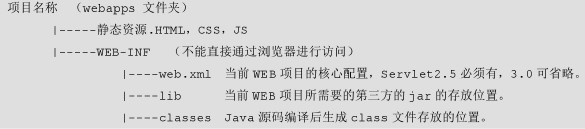
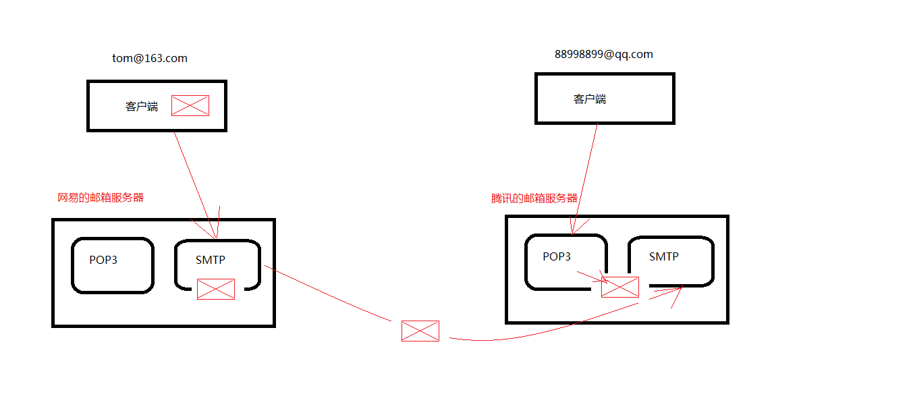
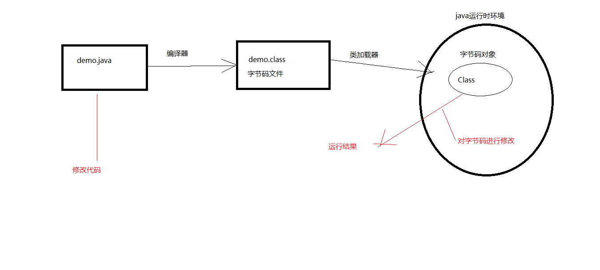

# Javaweb

##### 数据库操作

> 创建：普通创建，带字符集创建，带比较规则创建
>
> 更改：更改字符集 
>
> 删除：
>
> 查看：查看所有数据库，查看某个数据库定义，查看选中的数据库
>
> 使用：

##### 表操作

> 创建：关键字（primary key, unique, not null, auto_increment）
>
> 更改：更换表名，更改表字符集，更改列名，更改列信息，添加列，删除列
>
> 删除：
>
> 查看：查看所有表，查看表定义，查看表信息

##### 数据操作

- 插入数据

  > insert into table_name(col1,col2...) values(col1,col2...);

- 修改数据

  > update table_name set col1=value,col2=value where condition;

- 删除数据

  > delete from table_name where condition;
  >
  > truncate table table_table

- 查询数据

  > select [distinct] {* | col1,col2} from table_name where codition group by having order by;

- 查询常用条件

  > 关系运算符: <> !=
  >
  > 逻辑运算符: and or not
  >
  > 范围: in   not in   any   all	between..and...	is null	is not null
  >
  > 模糊查询: like	"_" "%"
  >
  > 别名查询: as	表别名，列别名
  >
  > 聚合函数: sum(), avg(), count(), max(), min()
  >
  > ​	1.聚合函数不能嵌套	2.聚合函数不能用于条件查询
  >
  > 排序: order by 	desc asc
  >
  > 分组: group by
  >
  > 分组过滤: having	后可跟聚合函数

- 多表查询

  > 交叉连接查询 笛卡尔积
  >
  > ​	select * from table1_name,table2_name;
  >
  > 内连接查询(显隐区别)
  >
  > ​	隐式内连接: select * from product p,category c where p.pid=c.cid;
  >
  > ​	显示内连接: select * from product p inner join category c on p.pid=c.cid;
  >
  > 左外连接查询（将左表中的数据全查询）
  >
  > ​	select * from prduct p left outer join category c on p.pid=c.cid;
  >
  > 右外连接查询（将右表中的所有数据均查询）
  >
  > ​	select * from product p right outer join category c on p.pid=c.cid;
  >
  > 分页查询
  >
  > ​	select * from table_name limit limit_index,limit_number;
  >
  > 子查询	将一个查询的结果做为另一个查询的条件

##### 表与表的关系

- 外键约束: foreign key

  > alter table table_name1 add foreign key(col_name) references table_name2(col_name);

- 一对一（一般用于拆表操作，如将个人常用信息与不常用信息分离开）

  > 1.将一对一的情况,当作是一对多情况处理,在任意一张表添加一个外键,并且这个外键要唯一,指向另外一张表
  >
  > 2.直接将两张表合并成一张表
  >
  > 3.将两张表的主键建立起连接,让两张表里面主键相等

- 一对多

  > 在多的一方添加外键约束指向一的一方的主键

- 多对多

  > 建立中间表，给中间表添加两个外键，将多对多拆分为两个一对多。

### JDBC入门(Java Database Connectivity)

##### 使用基本步骤

> 注册驱动	DriverManager.registerDriver(new com.mysql.jdbc.Driver);
>
> ​			Class.forName("com.mysql.jdbc.Driver");
>
> 建立连接	Connection conn = DriverManager.getConnecttion("jdbc:mysql://localhost/database","user","passroot");
>
> 创建Statement	Statement st = conn.createStatement();
>
> 执行Sql	ResultSet rs = st.excuteQuery(sql);
>
> ​		      int result = st.excuteUpdate(sql);
>
> 遍历结果集
>
> 释放资源	rs.close()   st.close()   conn.close()

##### JDBCUtil

> 封装获得连接以及释放资源细节，提供接口----获得连接，释放资源
>
> 工具类通过读取配置文件建立连接

##### JUnit单元测试

> 添加JUnit支持，对方法添加注解@Test

##### DAO模式(Data Access Object)

> 将数据库有关操作均放入DAO包中
>
> 创建DAO接口将实现分离

##### Statement安全问题

> Statement先生成对象，再执行SQL语句，会将传入的参数中的关键字定义为关键字
>
> 使用PrepareStatement可以解决此问题，它先根据SQL生成对象，在将传入的参数代替？，不会将参数的关键字作为SQL关键字
>
> ​	PrepareStatement ps = conn.preopareStatement(sql);
>
> ​	ps.setString(1,arg)...;
>
> ​	ps.excuteQurey();

### 连接池技术

##### 自定义连接池

> javax.sql.DataResource
>
> 方法增强方式：1.继承	2.装饰器设计模式	3.动态代理

##### C3P0连接池

> c3p0-config.xml

##### DBCP连接池

> *.properties
>
> properties读取方式

##### DBUtils

> JavaBean
>
> QueryRunner(query(),update())	BeanListHandler(), BeanHandler(), ScalarHandler

### XML

> 什么是 XML，与 HTML 有什么不同
>
> XML 常见用途
>
> XML 的文档声明
>
> XML 的元素，属性，注释
>
> XML 的转义字符，CDATA 区
>
> XML 常见约束，如何引入约束

##### XML语法

> ```xml
> <!-- 必须位于文档的0行0列 -->
> <?xml version="1.0" encoding="utf-8"?>
> ```
>
> CDATA 区
>
> > ```xml
> > <![CDATA[
> > 	<!-- 不需要使用转义字符，可以直接使用 < > & 等 -->
> > 	<!-- 不能包含 “] ] >” 它是CDATA的结尾标志 -->
> > ]]>
> > ```

##### DTD约束

> xml文档约束

##### Schema约束

> xml 文档约束，本身也为 xml 文档，扩展名为 .xsd
>
> 命名空间

##### XML解析

> 解析方式：DOM, SAX, PULL
>
> 解析器
>
> 解析开发包：JAXP, JDom, jsoup, dom4j

- dom4j

  > 将整个文档加载到内存，生成DOM树，获得Document对象，通过此对象对DOM进行操作

  ```java
  SAXReader saxReader = new SAXReader();
  Document document = saxReader.read(new File("com/xiaowen/xml/a.xml"));
  Element rootElement = document.getRootElement();
  String version = rootElement.attributeValue("version");
  List<Element> list = rootElement.elements();
  //getName()	getText()
  ```

##### 反射

- Class对象

  ```java
  Class c = Class.forName("java.lang.String");
  //Class c = String.class;
  //Class c = "string".getClass();
  String s = c.newInstance();
  ```

- Constructor对象

  ```java
  Constructor constructor = getConstrucrot(c, String.class); 
  ```

- Method对象

  ```java
  Method m = getMethod(c, );
  ```


### HTTP & Tomcat

##### HTTP

- http请求

  > 请求由请求行、请求头、请求体构成
  >
  > get 方式提交没有请求体  

  

- http响应

  > 响应由响应行、响应头、响应体构成


##### tomcat目录结构


##### tomcat 启动异常

> 1. JAVA_HOME 未正确配置
>
> 2. 端口被占用
>
>    处理方式：a. 通过 netstat -aov 命令查看活动链接获得占用端口的 PID ，杀死此 PID 进程即可
>
>    ​		   b. 修改 tomcat 配置端口 

##### Web 应用目录结构



##### Eclipse 下配置 tomcat

- 项目发布常见问题
  1. 在 Eclipse 中更改了项目名称后无法访问到项目(web project setting)
  2. 在 tomcat webapps 目录结构中删除项目后无法再部署此项目

##### Intellij 下配置 tomcat

> 1. tomcat 构建web项目
> 2. 配置 tomcat 服务器的方式
> 3. 加入 jar 包的三种方式

### Servlet 

##### servlet 配置

```xml
<servlet>
    <servlet-name></servlet-name>
    <servlet-class></servlet-class>
    <init-param>
        <param-name></param-name>
        <para-value></para-value>
    </init-param>
    <load-on-startup>3</load-on-startup>
</servlet>
<servlet-mapping>
    <servlet-name></servlet-name>
    <url-pattern></url-pattern>
</servlet-mapping>

<welcome-file-list>
	<welcome-file>index.html</welcome-file>
</welcome-file-list>
```

- url-pattern 配置方式

  > 完全匹配	目录匹配	扩展名匹配

- 缺省 Servlet

  ```xml
  <url-pattern>/</url-pattern>
  ```

  > 将在 tomcat 的全局配置 web.xml 中进行查找

##### servlet 生命周期

- API

  > init(ServletConfig config)
  >
  > ​	ServletConfig 对象：getServletName()  getServletContext()
  >
  > service(ServletRequest req, ServletResponse rep)
  >
  > destory()

- servlet 生命周期

  > 创建：第一次被访问
  >
  > 销毁：服务器关闭

##### servlet 访问过程

> tomacat 服务器获得请求url后，根据请求路径找到对应 Servlet 并创建，在创建 request, responce 对象执行 service 方法

#####  HttpServlet

> doGet()
>
> doPost()

##### ServletContext 对象

> ServletContext 代表一个 web 应用环境，一个 web 应用只有一个此对象

- ServletContext 生命周期

  > 创建：web 应用被加载
  >
  > 销毁：web 应用被卸载

- 获得 ServletContext 对象

  > config.getServletContext()
  >
  > this.getServletConfig()	(底层也是通过 config 获得)

- ServletContext 作用

  - 获得全局初始化参数

    ```java
    context.getInitParamter("");	//spring中有用到
    ```

    ```xml
    <context-name>
    	<param-name>Driver</param-name>
        <param-value>com.mysql.Driver</param-value>
    </context-name>
    ```

  - 获得 web 应用中任何资源的绝对路径

    ```java
    context.getRealPath("相对路径");
    //eclipse中最终是将WebContent中的所有内容拷贝到web应用中，其他资源无法进行访问
    //src下的资源存放在WEB-INF下的classes文件夹中
    //读取src(classes)下的文件时还可以用同类加载器
    ContextServlet.class.getClassLoader().getResource("相对路径(相对于src)").getPath();
    ```

  - ServletContext 是一个域对象

    > 域对象： 存储数据的区域
    >
    > ServletContext 域对象作用范围： 整个 web 应用（一个 servlet 中存储的数据，其他 servlet 均可取得）	

    ```java
    context.setAttribute(key, value);	//可通过此方式记录一个网站的总访问次数
    context.getAttribute(key);
    ```

    > 域对象的通用方法
    >
    > ​	setAttribute(String key, Object value);
    >
    > ​	getAttributr(String key);
    >
    > ​	removeAttribute(String key);

### Response

##### response 运行过程

> tomcat 引擎获得浏览器发出的请求信息后，根据请求封装一个 request 对象与一个空 response 对象，传给 servlet 的 service() 进行执行，服务器将根据请求获得的信息传入 response 缓冲区形成响应体，tomcat 引擎再从缓存区中取出信息加上引擎信息（响应行、响应头）封装成一个完整的 response 对象回传给浏览器进行显示

##### response API

- 设置响应行

  ```java
  setStatus(int sc);	//设置状态码
  ```

- 设置响应头

  > addHeader(String key, String value)	//常用	add 同名头信息多次则值会被多次添加
  >
  > addIntHeader(String key, int value)
  >
  > addDateHeader(String key, long date)	//date 为毫秒值
  >
  > setHeader(String key, String value)	//常用
  >
  > setIntHeader(String key, int value)
  >
  > setDateHeader(String key, long date)

- 重定向

  > 浏览器向 a 请求资源，a 无资源，告诉浏览器找 b
  >
  > 状态码：302	
  >
  > 响应头：Location

  ```java
  response.setStatus(302);
  response.setHeader("Location","b.html")；
  //封装的重定向方法
  response.sendRedirect("b.html");
  //通过定时刷新重定向(页面定时器 setInterval())
  response.setHeader("refresh","5;b.html");	//5 代表 5s
  ```

  

  > 会访问服务器两次
  >
  > 地址栏会发生变化

- 设置响应体

  ```java
  PrintWriter writer = response.getWriter();
  writer.write("-----");	//response 码表为 ISO-8859-1，写入中文会发生乱码
  
  //设置 response 查询码表为 utf-8,此语句也可不设置，当设置头信息后 response 缓冲区会自动以头信息设置的方式进行编码
  response.setCharacterEncoding("utf-8");
  //告知浏览器以 utf-8 解码
  response.setHeader("Content-Type","text/html;charset=utf-8");
  response.setContentType("text/html;charset=utf-8");
  
  //响应头设置字节
  ServletOutputStream out = response.getOutputStream();
  out.write(byte[] b);
  ```

- 实例：文件下载

  1. 什么情况下会文件下载？

     > 浏览器不能解析的文件会直接下载

  2. 什么情况下需要编写文件下载代码？

     > 实际开发中，要下载的文件均编写下载代码

     ```html
     <!-- 前端下载代码 -->
     <a href="download/downloadServlet?filename=a.mp3"></a>
     ```

     ```java
     //1.获得要下载的文件名
     String file = request.getParameter("filename");
     //2.告知要下载的文件的类型，浏览器通过文件的MIME类型区分文件类型
     response.setContentType(this.getServletContext.getMimeType(file));
     //3.告知客户端文件不直接解析，而是以附件形式进行下载
     response.setHeader("Content-Disposition","attachment;filename="+file);
     //4.获取文件绝对路径，用流进行读取写出
     ```

  3. 下载文件的文件名包含中文字符的异常？

     ```java
     //对获得的中文参数改变编解码方式
     file = new String(file.getBytes("ISP-8859-1","UTF-8");
     //获得请求头User-Agent信息，根据不同的浏览器设置文件不同的编码方式
     String agent = request.getHeader("User-Agent");
     if(agent.contains("Firefox")){...}                                            
     ```

##### response 细节点

> 1. response 获得的流不用手动关闭，tomcat 容器会帮助我们关闭
>
> 2. getWriter() 与 getOutputStream() 不能同时调用
>
>    会出现 500 状态码，错误：getWriter() has already been called for this response
>
> 3. response 默认缓冲区大小为 8k，可进行扩容，可通过 getBufferSize() 获得缓冲区大小
>
> 4. 重定向与转发代码后不再写代码

### Request

##### 获得请求行

- 获得请求方法

  ```java 
  String getMethod()
  ```

- 获得请求资源

  > String getRequestURI()	//所有地址都可叫做URI，获得的值与抓包得到的地址一致
  >
  > StringBuffer getRequestURL()	//一般把网络资源叫做URL
  >
  > String getContextPath()	//重要：获得web应用的名称
  >
  > String getQueryString()	//获得 get 提交 URL 地址后的参数字符串，要通过拆分字符串去获得具体值

- 获得客户端信息

  > getRomoteAddr()	//获得访问的客户端的 IP 地址

##### 获得请求头

> String getHeader(String key)	//常用
>
> int getIntHeader(String key)
>
> long getDateHeader(String key)
>
> Enumeration getHeaderNames()
>
> Enumeration getHeaders(String name)

- referer 头信息

  > 返回该次访问的来源
  >
  > 可用于做防盗链

##### 获得请求体

> 获得 post 请求的参数，get 提交方式也可使用

> String getParameter(String name)	//常用
>
> Map<String, String[]> getParameterMap()	//常用
>
> String[] getParameterValues(String name)
>
> Enumeration getParameterNames()

##### request 域对象

- request 作用范围

  >  request 是可用来储存数据的区域对象
  >
  > 作用范围：一次请求中

- request 请求转发

  > 浏览器向 a 请求资源，a 会自动去寻找 b 获得资源

  ```java
  //获得请求转发器
  RequestDispatcher dispatcher = request.getRequestDispatcher(String path);
  //执行转发
  dispatcher.forward(request, response);
  ```

- ServletContext 与 Request 域对象比较
  > 生命周期：
  >
  > ​	ServletContext: 服务器启动创建，服务器关闭销毁，存在于整个 web 应用中
  >
  > ​	Request: 每次访问时创建，响应结束时销毁，存在于一次请求中

- 转发与重定向区别

  > 1. 重定向为两次请求，转发为一次请求
  > 2. 重定向地址变化，转发地址不变
  > 3. 重定向可以访问外部网站，转发只能访问内部资源
  > 4. 转发的性能由于重定向

- 客户端地址与服务器地址的写法

  > 客户端地址：为访问的服务器的外部地址，需写上 web 应用的名称	直接访问，重定向
  >
  > 服务器地址：服务器内部资源的地址，不需写 web 应用的名称	转发

##### 注册功能实现

- 中文乱码问题

  ```java
  //设置 request 的编码 ----> 只适合 post 提交方式
  request.setCharacterEncoding("UTF-8");
  
  //乱码过程：中文--->utf-8编码--->iso8859-1解码--->乱码
  //get 方式乱码解决（适用于某一个参数）,也适用于 post 提交方式
  username = new String(username.getByte("iso8859-1"),"utf-8");
  ```

  

- BeanUtils

  > 将 Map 中的数据根据 key  与实体属性的对应关系封装，只要 key 的名字与实体的属性的名字一样就自动封装到实体中

  > 需要导入 beanutils 与 logging jar 包

  ```java
  Map<String, String[]> poperties = request.getParameterMap();
  User user = new User();
  BeanUtils.populate(user, poperties);
  ```

- UUID

  > 生成随机不重复的32位字符串，Java 代码生成后为36位
  >
  > 实际开发中 UUID 使用较多，很少使用自增长

  ```java
  String uuid = UUID.randomUUID().toString();		
  ```


- 注册成功后的操作

  > 重定向到登陆页面
  >
  > 不建议使用转发：1.转发地址栏不改变	2.转发后若执行刷新会再次回到注册页面

##### 登录信息的回显

- 将表单提交的数据获得，到数据库进行查找返回 User 对象，根据对象是否为空判断是否存在此用户
- 登录成功，则**重定向**到网站首页
- 登陆失败，**转发**到登录页面并进行错误信息的回显，使用 request 域存储错误信息
- 向 Jsp 页面写入错误信息，<%= java-coding%>，域对象中无内容则不显示(显示为 null 的问题)

### Cookie & Session

##### 会话技术简介

> 会话技术是用来帮助服务器记住客户端状态的。
>
> 从打开浏览器访问某个站点，到关闭整个浏览器的过程称为一次会话。
>
> Session 将信息存到服务器，安全性较好，但增加了服务器的压力。
>
> Cookie 将信息存到客户端，减少了服务器的压力，安全性不好，客户端可以清除 Cookie

##### Cookie

- API

  - 设置 cookie 的持久化时间

    > cookie.setMaxAge(int seconds);	//cookie 中会产生一个 expires 值代表失效时间

    ​    不设置持久化时间，cookie 会存储在浏览器的内存中，浏览器关闭 cookie 的信息被销毁（会话级别的 cookie ），设置持久化时间，cookie 会被持久化到浏览器的磁盘文件中

  - 设置 cookie 的携带路径

    > cookie.setPath();	//cookie 中产生一个 path 值表示携带路径

    ```java
    cookie.setPath("/");	//访问此服务器下的所有资源都带着这个cookie
    ```

    ​    不设置携带路径，cookie 信息会在访问产生该 cookie 的 web 资源所在的路径都携带 cookie 信息。（该资源的外部地址）

  - 删除 cookie

    > 使用同名同路径的持久化时间为0的 cookie 进行覆盖即可。

    ```java
    //新建一个cookie
    Cookie c = new Cookie("key","");
    //设置其 path 为与要删除的cookie path 一致
    c.setPath(String path);
    //设置持久化时间为0
    c.setMaxAge(0);    
    ```

    

- 服务器发送 Cookie 到客户端

  ```java
  //1.创建Cookie对象
  Cookie cookie = new Cookie("","");	//不能传入中文
  //2.发送cookie(以头形式传输	set-cookie: key=vlaue)
  response.addCookie(cookie);
  ```

  

- 服务器从客户端获取 Cookie

  ```java
  //获得所有Cookie
  Cookie[] cookies = request.getCookies();
  //获得cookie名字
  String name = cookie.getName();
  //获得cookie值
  String value = cookie.getValue();
  ```

- 显示网站上次访问时间

##### Session

​	Session 技术是基于 cookie 的，cookie 会存储 session 编号 JSESSIONID。发送 session 编号和根据编号寻找 session 值是客户端与服务器自动完成的，无需编码。

- 创建一个 session 区域

  ```java
  //此方法底层会自动判断当前客户端是否已经存在session，若不存在会自动创建一个session，若存在则返回已存在的session
  HttpSession session = request.getSession();
  String id = session.getId();	//返回session的JSESSIONID
  ```

  

- 向 session 存取数据(session 是一个域对象，作用范围为一次会话)

  > setAttribute(String key, Object value);
  >
  > getAttribute(String key);
  >
  > removeAttribute(String key);

- session 的生命周期

  > 创建：第一次执行 getSession() 时创建
  >
  > 销毁：1. 服务器（非正常）关闭	2. session 默认30分钟过期	3. 手动销毁

  - session 过期

    ```xml
    <!-- 可在web.xml中配置session的过期时间，tomcat全局配置中默认30分钟 -->
    <session-config>
        <session-timeout>20</session-timeout>
    </session-config>
    ```

    > session 过期时间计算起点：从不操作服务器端资源开始

  - 手动销毁

    > session.invalidate();

  - 浏览器关闭，seesion 就销毁了吗？

  - session 的持久化

    > 将存储JSESSIONID的cookie持久化即可

- 验证码校验功能实现

  > 获得输入的验证码
  >
  > 获得随机生成的验证码，通过存入 session 域
  >
  > 比较

### JSP

##### JSP 脚本和注释

- 脚本

  > <%	%>	//此脚本中的代码会被加载到 service 方法中
  >
  > <=%	%>	//此脚本中的代码加载到 out.print() 中
  >
  > <!%	%>	//此脚本中的代码属于全局代码，可写属性和方法	

- 注释

  > html 注释	<!-- -->	//可见范围 jsp/servlet/html
  >
  > Java 注释	//可见范围 jsp/servlet
  >
  > Jsp 注释	<%-- --%>	//可见范围 jsp

##### Jsp 运行原理

​	Jsp 在访问时会被 Web 容器翻译为 Servlet 再执行，被翻译后后的 Servlet 存放在 tomcat 的 work 目录下。

​	过程：访问---->\*.jsp---->\*_jsp.java(servlet)---->编译执行【此过程由 JspServlet 执行，全局 web.xml 已配置】

##### Jsp 指令

- page(实际开发中很少用)

  > <%@ page attribute1=value1 attribute2=value2 ... %>
  >
  > language	contextType	pageEncoding(内部包含contextType)	session(true)
  >
  > extends	import	errorPage(内部发生错误的跳转页面，404等错误无法跳转)	isErrorPage
  >
  > 404错误：可在 web.xml 中配置全局错误页面
  >
  > <error-page>
  >
  > ​	<error-code>404</error-code>
  >
  > ​	<location>/error.jsp</location>
  >
  > </errorPage>
  >
  > buffer(默认8kb， out 的缓冲区大小)

- include

  > 页面包含指令（静态包含），将一个 Jsp 页面包含到另一个 Jsp 页面
  >
  > <%@ include file="" %>

- taglib 指令

  > 在 Jsp 页面引入第三方标签库( jstl 标签库、struts2 标签库)
  >
  > <%@ taglib uri="" prefix="" %>

- Jsp 内置对象

  - pageContext(PageContext)

    > 当前页面的上下文对象，不同于 page 对象

    - pageContext 域对象(增添的方法)

      作用范围：当前 Jsp 页面

      > //使用 pageContext 可以操作其他域对象	
      >
      > //scope 可为: PageContext.REQUEST_SCOPE(SESSION_SCOPE/APPLICATION_SCOPE)
      >
      > setAttribute(String key, Object obj, int scope)
      >
      > getAttribute(String key, int scope)
      >
      > removeAttribute(String key, int scope)
      >
      > findAttribute(String key)	//按照域的作用范围大小依次搜索需要的值

    - 获得其他八大对象

      > pageContext.getRequest()
      >
      > pageContext.getSessiom()

  - session(HttpSession)

  - application(ServletContext)

  - config(ServletConfig)

  - out(JspWriter)

    > 向客户端输出内容	out.writer()
    >
    > 输出的内容先写入 out 缓冲区，在刷入 response 缓冲区，数据会显示在 response 缓冲区已有内容之后，response.getWriter().write() 方式写入的数据直接写入 response 缓冲区，可通过设置 page 的 buffer 值为0，让 out 对象的输出内容直接写入 response 缓冲区。

  - page(this)

  - request(HttpRequest)

  - response(HttpResponse)

  - exception(isErrorPage)

- Jsp 标签

  - 页面包含(动态包含)

    ```jsp
    <jsp:include page="" ></jsp:include>
    ```

    > 静态包含：将两个页面翻译到一个 Servlet
    >
    > 动态包含：翻译为两个 Servlet 页面，包含页面中使用 include 方法(执行到此方法才编译第二个 Jsp 页面)加载另一个页面

  - 请求转发

    ```jsp
    <jsp:forward page="" ></jsp:forward>
    ```

- 显示商品列表

### EL/JSTL

##### EL 表达式

> 可以嵌套在 jsp 页面内部，用于取出域对象中的数据

```jsp
//jsp脚本与El表达式对比
<%=request.getAttribute("name")%>
${requestScope.name}

//取字符串
${requestScope.name}
//取对象
${sessionScope.user.name}
//取容器
${applicationScope.list[0].name}

//全域查找
${key}
```

- El 的内置对象

  - pageScope, requestScope, sessionScope, applicationScope	//域对象

  - param, paramValues    //request.getParameter(), request.getParameterValues()

    > 用于在 jsp 页面中获得请求中的数据，在 Servlet 中开发基本不用

  - header, headerValues    //request.getHeader()

  - initParam    //全局初始化参数

  - cookie

  - pageContext

    > //获得 request 对象
    >
    > ${pageContext.request }
    >
    > //可用于获得web应用项目名称
    >
    > ${pageContext.request.contextPath }
    >
    > <%=pageContext.getRequest().getContextPath()%>	//此句不能执行，获得的不是HttpRequest

- EL 执行表达式

  > ${1+1 }
  >
  > ${1==1?true:false }
  >
  > ${empty user }	//判断一个值是否为空

##### JSTL

> Jsp 标准标签库，简化 Jsp 脚本，需导入 jstl 与 standard jar 包
>
> 它具有五个字库：Core(c)(常用), I18N(fmt), SQL(sql), XML(x), Functions(fn)

```jsp
<%@ taglib url="http://java.sun.com/jsp/jstl/core" prefix="c" %>
```

- 常用标签

  - \<c:if>

    ```jsp
    <c:if test="${1==1 }">
    </c:if>
    <c:if test={1!=1 }>
    </c:if>
    ```

  - \<c:foreach>

    ```jsp
    //具有两种方式
    <c:forEach begin="0" end="5" var="i">
    </c:forEach>
    
    <c:forEach items="集合或数组" var="集合中某一个元素">
    </c:forEach>
    ```

##### JavaEE 开发模式

- Web 开发模式----MVC

  > M: Model	模型: JavaBean----封装数据
  >
  > V: View	视图: Jsp----页面显示
  >
  > C: Controller	控制器: Servlet----获取数据封装并传递，并指定显示的页面

- JavaEE开发模式----三层架构

  实际开发时，通过包的结构体现三层结构。

  > Web 层: 与客户端进行交互
  >
  > Service 层: 复杂业务处理
  >
  > Dao 层: 与数据库进行交互 

### 事务

> 一个事务具有 n 个单元，它们要么同时执行成功，或同时执行失败。

##### MySql 事务

> MySql 自动开启事务，默认一条 SQL 语句为一条事务

手动开启事务

> 显示开启一个事务	start transaction；
>
> 提交事务(不提交则默认回滚)	commit;
>
> 事务回滚	rollback;

##### JDBC 操作事务

> 默认开启事务，执行 executeUpdate() 时

```java
conn.setAutoCommit(false);	//开启事务，设置自动提交为 false
conn.commit();	//提交事务
conn.rollback();	//事务回滚
//控制事务的 connection 与控制 SQL 的必须时同一个
```

##### DBUtils 事务操作

```java
//空参构造QueryRunner对象，获得conn用来操作事务
QueryRunner qr = new QueryRunner();
Connection conn = DataSourceUtil.getConnection();
//开启事务 提交事务 回滚事务
conn.setAutoCommit(false);
//使用带有conn参数的update方法
qr.update(conn,sql,param);
conn.commit();
conn.rollback();
```

##### 转账功能实现

> DAO 层只进行数据库的操作，事务控制在 service 执行，为了保证事务控制的 conn 与数据库操作的 conn 为同一个 conn，要在 service 将创建的 connection 进行传递。
>
> commit 最好写在 finally 语句中。

##### ThreadLocal 

> 类似于 Map ，将当前线程作为 key。一个 ThreadLocal 只能绑定一个值。

> 在转账功能实现中，我们将 conn 从 service 层传到了 dao 层，这种方式使得操作数据库资源的 conn 出现在了 service ，这不是我们希望看到的。由于在 web, service, dao 三成架构中，所有的方法调用都是一个线程完成的，因此我们可以通过线程绑定的方式来解决这个问题。

```java
//在DataSourceUtil中创建一个ThreadLocal对象用于绑定conn
ThreadLocal<connection> tl = new ThreadLocal<Connection>();
//在DataSourceUtil中封装一个获得当前连接的方法
public static Connection getCurrentConnection() throws Exception{
    //获得当前线程绑定的conn
    Connection conn = tl.get();
    if(conn == null){
        //如果当前线程未绑定conn，则从线程池中取出一个
        getConnection();
        //将取出的conn绑定到当前线程
        tl.set(conn);
    }
    return conn;
}
//在DataSourceUtil中封装事务开启，提交，回滚的方法
public static void startTransactionn() throws Exception(){
    Connection conn = getCurrentConnection();
    conn.setAutoCommit(false);
}
public static void commit() throws Exception(){
    Connection conn = getCurrentConnection();
    conn.commit();
    //将 conn 移除
    tl.remove();
    //将 conn 归还
    conn.close;
}
public static void rollback() throws Exception(){
    Connection conn = getCurrentConnection();
    conn.rollback();
}
```

##### 事务的特性 ACID	

- 原子性(Atomicity)

  > 事务是不可分割的单位，事务中的操作要么同时发生，要么同时回滚。

- 一致性(Consistency)

  > 事务前后数据的完整性必须保持一致。

- 隔离性(Isolation)

  > 多个事务并发执行时，互不影响。一个事务不能被其他事务所影响。

- 持久性(Durability)

  > 一个事务执行后，它对数据的操作就时永久性的。

##### 并发访问问题(隔离性)

- 脏读

  > B 事务读取到 A 尚未提交的数据。要求 B 事务应不能读取到 A 事务未提交的数据

- 不可重复读

  > 一次事务中，两次读取的数据内容不一致。要求一个事物中多次读取的数据内容应是一致的(update)

- 幻读/虚读

  > 一个事务中，两次读取的数据的数量不一致。要求一个事务中多次读取的数据数量应是一致的(insert/delete)

- 事务的隔离级别

  > read uncommitted: 读取尚未提交的数据，不能解决并发问题
  >
  > read committed: 读取已提交的数据，可解决脏读
  >
  > repeatable read: 重读读取，可解决脏读，不可重复读
  >
  > serializable: 串行化，可解决所有并发问题，但性能太低，相当于锁表
  >
  > 性能从上到下，安全性从下到上

  Oracle 默认隔离级别为 read committed, MySql 默认隔离级别为 repeatable read

  > 查看 MySql 默认隔离级别：select @@tx_isolation;
  >
  > 设置 MySql 的隔离级别：set session transaction isolation level value;

### 商城后台系统

##### 查询功能

##### 添加功能

##### 删除功能

- 友情提示(JS)	

  ```jsp
  <script>
  	function delProduct(pid){
  		var isDel = confirm("确认删除？")；
          if(isDel){
              window.location.href = "${pageContext.request.contextPath }/del?pid="+pid;
          }else{
              
          }
  	}
  </script>
  
  <!-- javascript:void(0); 此代码可阻止a标签内置点击事件 -->
  <a href="javascript:void(0);" onclick="delProduct('${pro.pid }')"></a>
  ```

  

> 逻辑删除：改变商品状态，实则为 update 操作
>
> 物理删除：从数据库真实删除(传递商品 pid 参数)，delete 操作

- 添加功能：删除多个商品

##### 修改功能

- 数据回显

  > 下拉框的回显(JS, JQurey)

- 数据修改

  > 前台传递数据到 service ，post 提交方式下可通过 type 为 hidden 的 input 标签进行传递

  ```jsp
  <input type="hidden" name="pid" value="${product.pid }" />
  ```

##### 筛选功能

> vo 包，类似于 domain 包，又来封装零散的值对象

> 筛选功能中条件个数是不确定的，因此要通过判断来拼接 SQL 语句。
>
> 筛选后筛选条件的回显。

### 分页

- 分页栏

  > PageBean 封装需要的散装数据，当前页商品数据，当前页数，总页数，总商品数量等

### Ajax

##### 同步异步

> 同步现象：客户端发送请求到服务端，当服务器返回响应之前，客户端处于等待卡死状态
>
> 异步现象：客户端发送请求到服务端，无论服务器是否返回响应，客户端可以随意操作

##### Ajax 运行原理

> 页面发起请求，请求会被发送给浏览器内核中的 Ajax 引擎，Ajax 引擎会提交请求到客户端，这段时间内，客户端可以进行任意操作，直到服务端返回数据给 Ajax 引擎后，会触发你的设置事件，执行 js 逻辑代码完成页面功能。

##### Js 原生 Ajax（了解）

使用步骤：

> 1. 创建 Ajax 引擎对象
> 2. 为 Ajax 引擎对象绑定监听
> 3. 绑定提交地址
> 4. 发送请求
> 5. 接受响应数据

```js
function ajaxFn() {
    var xmlHttp = new XMLHttpRequest();
    xmlHttp.onreadystatechange = function() {	//引擎具有5个状态(readyState)，01234
        if(xmlHttp.readyState==4 && xmlHttp.state==200){
            var data = xmlHttp.responseText;
        }
    }
    //true代表异步访问，get提交方式可直接拼接参数，post提交参数在send()中传递，并需要加头信息(文档)。
    xmlHttp.open("GET","客户端地址",true);
    xmlHttp.send();
}
```

##### Json

> Json 是一种数据交换格式，作用：1. 使用 Ajax 进行前后台数据交换； 2. 移动端与服务端的数据交换
>
> Json 是 Js 的原生格式，Js 可以直接取出 Json 对象中的数据，key 为字符串，value 为 Object

- 两种格式

  > 对象格式：{"key1":obj1, "key2":obj2, "key3":obj3}
  >
  > 数组格式：[obj1, obj2, obj3]
  >
  > 对象格式可以和数组格式互相嵌套

##### JQuery 中的 Ajax

- $.ajax({option1:value1,option2:value2})

  ```js
  function fnAjax(){
      $.ajax(
      	url:"客户端地址",
          async:是否异步,
          type:"请求方式",
          data:{请求参数json格式},
          success:function(data){	//请求成功的回调函数
          
      	},
          error:function(){	//请求失败的回调函数
                  
          },
          dataType:"返回数据格式"
      );
  }
  ```

  

- $.get(url, [data], [callback], [type])

  ```js
  function fnGet() {
      $.get(
      	"",	//url地址
          {"name":"zhangsan","age":"25"},	//请求参数
          function(data){	//执行成功后的回调函数 data代表服务器返回的数据，类型与返回类型一致
              //Java中无Json对象，直接书写Json格式的字符串即可，但不能使用单引号，因为Ajax会默认调用parseJson方法，当传入畸形Json时此方法会报错
          },
          "json"
      );
  }
  ```

- $.post(url, [data], [callback], [type])

  > 代码与 get 方法相同
  >
  > 区别：1. 提交的参数大小限制不同； 2. 接受数据的中文乱码问题，post 方式不会出现乱码

##### 异步校验用户名是否存在

##### 站内查询

- Json 转换工具

  > 1. jsonlib	需导入jason-lib jar包	JsonArray.for
  > 2. gson---->google    需导入gson包    gson.toJson();
  > 3. fastjson---->alibaba

### 监听器

监听三个域对象（page 域除外）状态变化的组件

##### 相关概念

> 事件源：被监听的对象
>
> 监听器
>
> 注册监听器
>
> 响应行为

##### 响应分类

###### 监听域对象的创建与销毁

- ServletContextListener

  > 监听 ServletContext 域的创建与销毁

  创建步骤：

  ```java
  //a.编写监听器类实现监听器接口
  //b.覆盖监听器的方法
  public class MyServletContextListener implemtnes ServletContextListener {
      //监听context域的创建
      public void contextInitialized(ServletContextEvent sce){
          sce.getServletContext();	//获得被监听的对象
          sce.getSource();	//获得被监听的对象，通用方法
          System.out.println(context创建了...)；
      }
      //监听context域的销毁
      public void contextDestroyed(ServletContextEvent sce){
          System.out.println(context销毁了...)；
      }
  }
  //c.在web.xml中进行配置---->注册
  <listener>
  	<listener-class>完整包路径</listener-class>
  </listener> 
  ```

  作用：

  > 1. 初始化工作（如初始化连接池，加载数据库驱动，能不用静态最好别用）
  > 2. 加载一些初始化配置文件（如spring的配置文件）
  > 3. 任务调度（如定时器，Timer/TimerTask）

  ```java
  Timer timer = new Timer();
  timer.scheduleAtFixedRate(new TimerTask(){
      public void run(){
          System.out.print("任务执行了...");
      }
  }, new Date(), 5000);
  ```

  

- HttpSessionListener

  创建步骤：同ServletContextListener

  > 一个 web 应用中有多个 session 对象：se.getSession().getId();
  >
  > 访问一个 jsp 时会默认创建 session 对象，由于page 指令中 session 属性为 true；
  >
  > 作用：可用于计数应用有多少客户端访问

- ServletRequestListener

###### 监听域对象的属性变化

> setAttribute();    removeAttribute();

- ServletContextAttributeListener

  > 监听添加、修改、删除操作

- HttpSessionAttributeListener

- ServletRequestAttributeListener

###### 与 session 中绑定的对象相关的监听器（对象感知监听器）

- 将被绑定的 session 对象的状态

  > 绑定：
  >
  > 解绑：
  >
  > 钝化：将 session 内存中的对象持久化到磁盘
  >
  > 活化：将磁盘上的对象再次恢复到 session 中

  >  用户很多时，如何对服务器进行优化？	

- HttpSessionBindingListener(注册给将绑定到 session 对象)

```java
//此监听器不需要配置
public class Person implements HttpSessionBindingListener{
    private String name;
    private int age;
    //绑定方法
    public void valueBound(HttpSessionBindingEvent event){
        
    }
    //解绑方法
    public void valueUnbound(HttpSeesionBindingEvent event){
        
    }
}
```

- HttpSessionActivationListener

```java
//此监听器不需要配置
public class Person implements HttpSessionActivationListener, Serlizable{
    private String name;
    private int age;
    //钝化方法
    public void sessionWillPassivate(HttpSessionEvent se){
        
    }
    //活化方法
    public void sessionDidActivate(HttpSeesionEvent se){
        
    }
}
```

> 服务器关闭对象会自动被钝化
>
> 服务器开启对象会自动被活化
>
> 可通过配置文件设置对象何时被钝化，在 META-INF 中添加一个 xml 文件进行配置 

##### 邮箱服务器

> 邮箱服务器：进行邮件的接受与推送
>
> 邮件发送的协议：
>
> ​	接受邮件的协议：POP3	IMAP
>
> ​	发送邮件的协议：SMTP

- 邮件发送过程

  

- 通过程序自动发送邮件

  > mail.jar	MailUtil.java

##### 定时发送生日祝福

> 通过 ServletContextListener 监听器，使用任务调度功能，结合邮件自动发送程序即可完成，TimerTask 即为定时发送邮件

### Filter 过滤器

##### 概述

​	filter 是对客户端访问资源的过滤，符合条件的放行，不符合条件的不放行，并且可以对目标资源访问前后进行逻辑处理。

​	场景：公共代码提取，对 request, response 的方法进行增强，权限设置......

##### 使用步骤

> 1. 编写一个过滤器的类实现 Filter 接口
> 2. 实现接口方法(doFilter())
> 3. 在 web.xml 中进行配置(配置对那些资源进行过滤)

```java
public class MyFilter implements Filter{
    //config可获得ServletContext对象
    public void init(FilterConfig config){}
    //FilterChain:过滤器链对象（它知道一切filter对象）
    public void doFilter(ServletRequest request, ServletResponse response, FilterChain chain){
        chain.doFilter(request, response);
    }
    public void destroy(){}
}
```

```xml
<!-- filter 配置 -->
<filter>
	<filter-name></filter-name>
    <filter-class></filter-class>
</filter>
<filter-mapping>
	<filter-name></filter-name>
    <!-- 具有三种配置方式 -->
    <!-- /*表示对所有访问资源进行过滤,执行顺序按mapping的出现顺序 -->
    <url-pattern>/*</url-pattern>
    <servlet-name>效果同url-pattern</servlet-name>
    
    <!--
		访问的方式：
			REQUEST:默认值，直接访问某个资源时执行
			FORWARD:转发时才执行
			INCLUDE:包含资源时执行
			ERROR:发生错误时执行
	-->
    <dispatcher>REQUEST</dispatcher>
</filter-mapping>
```

##### API

> init()	//filter 何时创建：服务启动时创建
>
> doFilter()	//每次访问被过滤的 servlet 对象时执行
>
> destroy()	//filter 何时销毁：服务器关闭时销毁

##### 自动登录功能

> 登录成功后将 user 对象放入 session 域中：1.返回别的资源时根据用户是否登录； 2.user 的信息在任何地方都可能用到
>
> 自动登录：在 servlet 中判断是否需要自动登录，若需要，将信息存储到 cookie 中，下次访问时通过过滤器获得 cookie 中的用户信息并存入 session
>
> cookie 不能存入中文字符，为了解决这个问题，可在存入之前对数据进行编码，获取时再对数据进行解码
>
> ​	URLEecoder.encode(String s, String character);
>
> ​	URLDecoder.decode(String s, String character);

##### 全局乱码问题解决

> 在 filter 中抽取乱码解决代码：
>
> ​	response.setContextType("text/html;charset=utf8");
>
> ​	request.setCharacteEncoding("utf8");
>
> 以上方式对于 get 提交方式获取的参数乱码问题无法解决，因此可通过装饰者设计模式增强 request 的 getParameter() 方法来解决 get 提交方式的乱码问题，HttpServletRequestWrapper 类对 request 接口的方法提供了实现，适用于对 request 的方法进行增强


### 类加载器

- 类加载器运行过程

  

- 类加载器分类

  > BootStrap: 引导类加载器，加载最基础的文件	rt.jar
  >
  > ExtClassLoader: 扩展类加载器，加载基础的文件	lib/ext/*.jar
  >
  > AppClassLoader: 应用类加载器，加载三方 jar 包和自己编写的文件
  >
  > 自定义类加载器

- 获得类加载器

  > ClassLoader cl = this.getClass().getClassLoader;
  >
  > cl.getResource(” “).getPath();	//获得 src 下的任何资源的地址，获得某包下的资源，需要添加包路径
  >
  > cl.getResourceAsStream(" ");	//获得某个文件的流对象

  

### 注解

​	注解是符合一定格式的语法，并具有一定的功能(@xxx)，主要作用是代替配置文件

​	优点：开发效率高，成本低

​	缺点：耦合性大，不利于后期维护

##### jdk5 提供的注解

> @Override	//帮助开发人员检查是否正确覆盖父类的方法
>
> @SuppressWarnings("all")	//可用于属性，方法，类
>
> @Deprecated

##### 自定义注解

```java
public @interface MyAnno {
    //注解的属性:基本类型，String类型，枚举类型，注解类型，Class类型，以上的一维数组类型
    String name();
    int age() default 10;
    String[] value();
}
```

##### 元注解

> @Target({TYPE, FIELD, METHOD,PARAMETER, CONSTRUCTOR, LOCAL_VARIABLE}) //注解使用范围
>
> @Retention(RetentionPolicy.SOURCE) //注解可见级别 SOURCE/CLASS/RUNTIME

##### 注解解析（通过反射）


### 动态代理

##### 代理

- 静态代理

  

- 动态代理

  ```java
  //Proxy.newProxyInstance(ClassLoader loader, Class<?>[] interfaces, InvocationHandler h) 
  public class ProxyTest{
      public static void main(String[] args) {
          //获得动态代理的代理对象----在运行时，在内存中动态的为Target创建一个虚拟的代理对象
          //objProxy是代理对象 根据参数确定到底是谁的代理对象
          TargetInterface objProxy = Proxy.newProxyInstance(
              //与目标对象相同的类加载器
          	Target.class.getClassLoader(),
              new Class[]{TargetInterface.class},
              new InvocationHandler(){
                  //proxy 代表代理对象
                  //invoke 代表的是执行代理对象的方法
                  //method 代表的是目标对象的方法字节码对象
                  //args 代表目标对象的相应方法的参数
                  public Object invoke(Object proxy, Method method, Object[] args) throws Throwable{
                      //执行目标对象的方法，可在此方法前后进行逻辑处理
                      method.invoke(new Target(), args);
                      return null;
                  }
              }
          );
          
          objProxy.method1();	//代理对象调用接口具有的方法
      }
  }
  ```

  