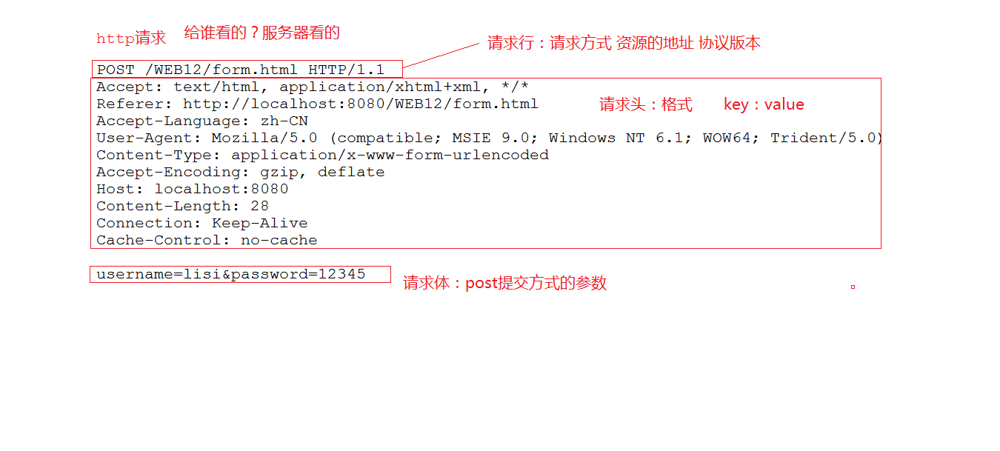
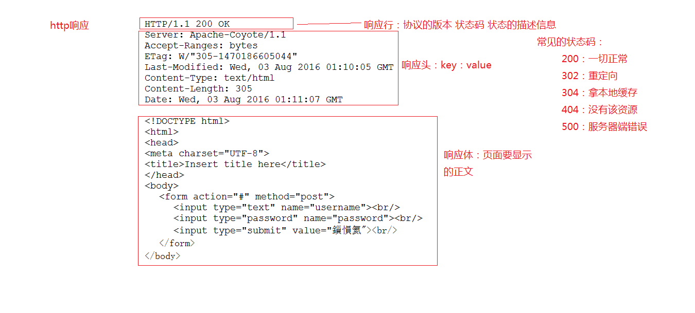
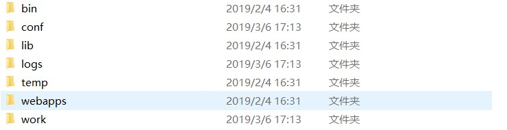

# Javaweb

##### 数据库操作

> 创建：普通创建，带字符集创建，带比较规则创建
>
> 更改：更改字符集 
>
> 删除：
>
> 查看：查看所有数据库，查看某个数据库定义，查看选中的数据库
>
> 使用：

##### 表操作

> 创建：关键字（primary key, unique, not null, auto_increment）
>
> 更改：更换表名，更改表字符集，更改列名，更改列信息，添加列，删除列
>
> 删除：
>
> 查看：查看所有表，查看表定义，查看表信息

##### 数据操作

- 插入数据

  > insert into table_name(col1,col2...) values(col1,col2...);

- 修改数据

  > update table_name set col1=value,col2=value where condition;

- 删除数据

  > delete from table_name where condition;
  >
  > truncate table table_table

- 查询数据

  > select [distinct] {* | col1,col2} from table_name where codition group by having order by;

- 查询常用条件

  > 关系运算符: <> !=
  >
  > 逻辑运算符: and or not
  >
  > 范围: in   not in   any   all	between..and...	is null	is not null
  >
  > 模糊查询: like	"_" "%"
  >
  > 别名查询: as	表别名，列别名
  >
  > 聚合函数: sum(), avg(), count(), max(), min()
  >
  > 	1.聚合函数不能嵌套	2.聚合函数不能用于条件查询
  >
  > 排序: order by 	desc asc
  >
  > 分组: group by
  >
  > 分组过滤: having	后可跟聚合函数

- 多表查询

  > 交叉连接查询 笛卡尔积
  >
  > 	select * from table1_name,table2_name;
  >
  > 内连接查询(显隐区别)
  >
  > 	隐式内连接: select * from product p,category c where p.pid=c.cid;
  >	
  > 	显示内连接: select * from product p inner join category c on p.pid=c.cid;
  >
  > 左外连接查询（将左表中的数据全查询）
  >
  > 	select * from prduct p left outer join category c on p.pid=c.cid;
  >
  > 右外连接查询（将右表中的所有数据均查询）
  >
  > 	select * from product p right outer join category c on p.pid=c.cid;
  >
  > 分页查询
  >
  > 	select * from table_name limit limit_index,limit_number;
  >
  > 子查询	将一个查询的结果做为另一个查询的条件

##### 表与表的关系

- 外键约束: foreign key

  > alter table table_name1 add foreign key(col_name) references table_name2(col_name);

- 一对一（一般用于拆表操作，如将个人常用信息与不常用信息分离开）

  > 1.将一对一的情况,当作是一对多情况处理,在任意一张表添加一个外键,并且这个外键要唯一,指向另外一张表
  >
  > 2.直接将两张表合并成一张表
  >
  > 3.将两张表的主键建立起连接,让两张表里面主键相等

- 一对多

  > 在多的一方添加外键约束指向一的一方的主键

- 多对多

  > 建立中间表，给中间表添加两个外键，将多对多拆分为两个一对多。

### JDBC入门(Java Database Connectivity)

##### 使用基本步骤

> 注册驱动	DriverManager.registerDriver(new com.mysql.jdbc.Driver);
>
> 			Class.forName("com.mysql.jdbc.Driver");
>
> 建立连接	Connection conn = DriverManager.getConnecttion("jdbc:mysql://localhost/database","user","passroot");
>
> 创建Statement	Statement st = conn.createStatement();
>
> 执行Sql	ResultSet rs = st.excuteQuery(sql);
>
> 		      int result = st.excuteUpdate(sql);
>
> 遍历结果集
>
> 释放资源	rs.close()   st.close()   conn.close()

##### JDBCUtil

> 封装获得连接以及释放资源细节，提供接口----获得连接，释放资源
>
> 工具类通过读取配置文件建立连接

##### JUnit单元测试

> 添加JUnit支持，对方法添加注解@Test

##### DAO模式(Data Access Object)

> 将数据库有关操作均放入DAO包中
>
> 创建DAO接口将实现分离

##### Statement安全问题

> Statement先生成对象，再执行SQL语句，会将传入的参数中的关键字定义为关键字
>
> 使用PrepareStatement可以解决此问题，它先根据SQL生成对象，在将传入的参数代替？，不会将参数的关键字作为SQL关键字
>
> 	PrepareStatement ps = conn.preopareStatement(sql);
>	
> 	ps.setString(1,arg)...;
>	
> 	ps.excuteQurey();

### 连接池技术

##### 自定义连接池

> javax.sql.DataResource
>
> 方法增强方式：1.继承	2.装饰器设计模式	3.动态代理

##### C3P0连接池

> c3p0-config.xml

##### DBCP连接池

> *.properties
>
> properties读取方式

##### DBUtils

> JavaBean
>
> QueryRunner(query(),update())	BeanListHandler(), BeanHandler(), ScalarHandler

### XML

> 什么是 XML，与 HTML 有什么不同
>
> XML 常见用途
>
> XML 的文档声明
>
> XML 的元素，属性，注释
>
> XML 的转义字符，CDATA 区
>
> XML 常见约束，如何引入约束

##### XML语法

> ```xml
> <!-- 必须位于文档的0行0列 -->
> <?xml version="1.0" encoding="utf-8"?>
> ```
>
> CDATA 区
>
> > ```xml
> > <![CDATA[
> > 	<!-- 不需要使用转义字符，可以直接使用 < > & 等 -->
> > 	<!-- 不能包含 “] ] >” 它是CDATA的结尾标志 -->
> > ]]>
> > ```

##### DTD约束

> xml文档约束

##### Schema约束

> xml 文档约束，本身也为 xml 文档，扩展名为 .xsd
>
> 命名空间

##### XML解析

> 解析方式：DOM, SAX, PULL
>
> 解析器
>
> 解析开发包：JAXP, JDom, jsoup, dom4j

- dom4j

  > 将整个文档加载到内存，生成DOM树，获得Document对象，通过此对象对DOM进行操作

  ```java
  SAXReader saxReader = new SAXReader();
  Document document = saxReader.read(new File("com/xiaowen/xml/a.xml"));
  Element rootElement = document.getRootElement();
  String version = rootElement.attributeValue("version");
  List<Element> list = rootElement.elements();
  //getName()	getText()
  ```

##### 反射

- Class对象

  ```java
  Class c = Class.forName("java.lang.String");
  //Class c = String.class;
  //Class c = "string".getClass();
  String s = c.newInstance();
  ```

- Constructor对象

  ```java
  Constructor constructor = getConstrucrot(c, String.class); 
  ```

- Method对象

  ```java
  Method m = getMethod(c, );
  ```


### HTTP & Tomcat

#### HTTP

###### 简述：

http 协议是一种规范，它规定了各个浏览器和服务器通信的标准，不管什么浏览器，只要是遵循 http 协议，就可以被解析

###### 特点：

> 遵循请求响应模型
>
> 无状态协议
>
> http 端口是 80（扩展：ftp 端口是 21）
>
> http 属于应用层协议

###### http请求

> 请求由请求行、请求头、请求体构成
>
> get 方式提交没有请求体  



###### http响应

> 响应由响应行、响应头、响应体构成



#### tomcat

###### 概述

既是服务器又是容器，tomcat 默认支持 servlet 和 jsp 运行；tomcat 负责创建 servlet 以及对 servlet 里面数据的封装，和 servlet 方法的调用

###### tomcat 对 servlet 提供的支持

通信支持 ：tomcat 会调用 servlet 的 api 方法来进行通信，service 方法 tomcat 默认调用

多线程支持：tomcat 默认实现多线程，每次请求都会默认创建新的线程来处理（servlet 效率比较高）

jsp 支持 ：tomcat 也支持 jsp

生命周期管理：tomcat 负责对 servlet 进行创建和销毁	

安全信息管理：tomcat 具有一些安全验证，保证服务器信息安全，如 web-info

###### tomcat目录结构



###### tomcat 启动异常

> 1. JAVA_HOME 未正确配置
>
> 2. 端口被占用
>
> 处理方式：a. 通过 netstat -aov 命令查看活动链接获得占用端口的 PID ，杀死此 PID 进程即可
>
> 		   b. 修改 tomcat 配置端口 

###### Web 应用目录结构


###### Eclipse 下配置 tomcat

- 项目发布常见问题
  1. 在 Eclipse 中更改了项目名称后无法访问到项目(web project setting)
  2. 在 tomcat webapps 目录结构中删除项目后无法再部
