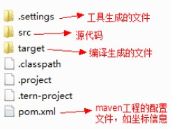
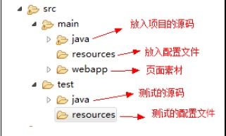
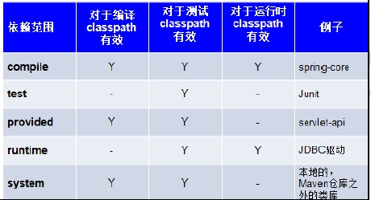

# MAVEN

### 概述

Maven 是一个项目管理工具，它包含了一个项目对象模型(POM)，一组标准集合，一个项目生命周期，一个依赖管理系统，和用来运行定义在生命周期阶段中插件目标的逻辑

项目对象模型：一个 maven 工程都有一个 pom.xml 文件，通过 pom.xml 文件定义项目的坐标、项目依赖、项目信息、插件目标等

依赖管理系统：通过 maven 的依赖管理对项目所依赖的 jar 包进行统一管理

项目生命周期：使用 maven 完成项目的构建，项目构建包括：清理、编译、测试、部署等过程，maven 将这些过程规范为一个生命周期，maven 通过执行一些简单命令即可实现生命周期的各个过程

标准集合：maven 将整个项目管理过程定义一组标准，比如：通过 maven 构建工程有标准的目录结构，有标准的生命周期阶段、依赖管理有标准的坐标定义等

插件目标：maven 管理项目生命周期过程都是基于插件完成的

### 功能

###### 依赖管理

maven 工程中不直接将 jar 包导入到工程，而是通过在 pom.xml 中添加所需 jar 包的坐标，通过此坐标到 maven 仓库中找到所需 jar 包；maven 仓库中具有索引，可以大大提高加载 jar 包的速度

###### 一键构建

项目的编译、测试、运行、打包、安装、部署整个构建过程，maven 通过一个命令可以帮助我们完成整个构建过程

### 仓库

**本地仓库**

用来存储从远程仓库或中央仓库下载的插件和 jar 包，项目使用一些插件或 jar 包，优先从本地仓库查找
默认本地仓库位置在 `${user.dir}/.m2/repository`，`${user.dir}` 表示 windows 用户目录

**远程仓库**

如果本地需要插件或者jar包，本地仓库没有，默认去远程仓库下载，远程仓库可以在互联网内也可以在局域网内

**中央仓库**

在 maven 软件中内置一个远程仓库地址 `http://repo1.maven.org/maven2` ，它是中央仓库，服务于整个互联网，它是由 Maven 团队自己维护，里面存储了非常全的 jar 包，它包含了世界上大部分流行的开源项目构件。

###### 本地仓库配置

```xml
<!-- 在setting.xml中添加配置 -->
<localRepository>D:/repository</localRepository>
```

###### 全局 setting 与用户 setting

maven 仓库地址、私服等配置信息需要在 setting.xml 文件中配置，分为全局配置和用户配置

maven会先找用户配置，如果找到则以用户配置文件为准，否则使用全局配置文件，用户配置的 setting.xml 文件默认的位置在： `${user.dir} /.m2/settings.xml` 目录中

### Maven 工程目录结构



普通 java 项目没有 webapp 目录

### 常用命令

通过 maven 命令可以对项目进行编译、测试、运行、打包、安装、部署

> compile：编译命令，将 src/main/java 下的文件编译为 class 文件输出到 target 目录下
>
> test：测试命令，会执行 src/test/java 下的单元测试类
>
> clean：清理命令，执行 clean 会删除 target 目录及内容
>
> package：打包命令，对于 java 工程执行 package 打成 jar 包，对于 web 工程打成 war 包
>
> install：安装命令，执行 install 将 maven 打成 jar 包或 war 包发布到本地仓库

### 生命周期

maven 对项目构建过程分为三套相互独立的生命周期

> Clean Lifecycle: 进行真正的构建之前进行一些清理工作
>
> Default Lifecycle: 构建的核心部分：编译、测试、打包、部署等等
>
> Site Lifecycle: 生成项目报告、站点、发布站点

### 依赖范围



默认范围为编译范围(compile)

