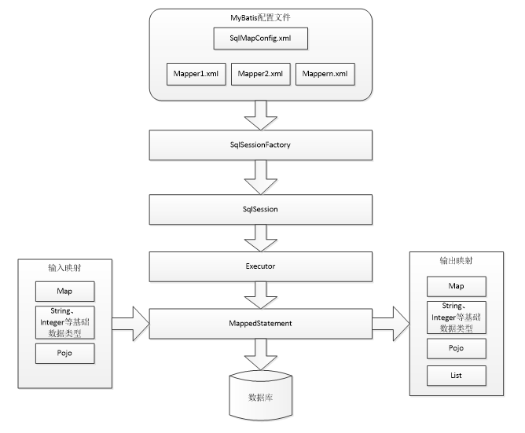

# MYBATIS

### 概述

MyBatis 原来是 apache 的一个开源项目 iBatis，2010 年由 apache software foundation 迁移到 Google code，并更名为 MyBatis，2013 年 11 月迁移到 GitHub。

MyBatis 是一个持久层框架，对 jdbc 的操作数据库的过程进行了封装，使开发者只需要关注 SQL 本身。它通过 xml 或注解的方式将要执行的各种 statement 配置起来，通过 Java 对象和 statement 中的 SQL 进行映射生成最终执行的 SQL 语句，最后由 MyBatis 框架执行 SQL 并将结果映射成 Java 对象并返回

### MyBatis 解决原生 JDBC 问题总结

1. 数据库频繁创建连接、释放资源造成系统资源的浪费，影响系统性能（使用数据库连接池可以解决）

   解决：SqlMapConfig.xml 中配置了数据库连接池，使用连接池管理数据库连接

2. SQL 语句存在硬编码问题，实际应用中 SQL 变化的可能性较大，SQL 变动需要改变 Java 代码，造成代码不易维护

   解决：将 SQL 语句配置再 mapper.xml 中实现与 Java 代码分离

3. 使用 preparedStatemet 对占位符传参数存在硬编码，SQL 语句的条件可能增加或减少

   解决：MyBatis 自动将java对象映射至 SQL 语句，通过 statement 中的 parameterType 定义输入参数的类型

4. 结果集的解析存在硬编码，SQL 变化可能导致解析代码变化（将数据库记录封装成 POJO 对象解析比较方便）

   解决：MyBatis 自动将 SQL 执行结果映射至 Java 对象，通过 statement中 的 resultType 定义输出结果的类型

### MyBatis 架构



Executor 具有 BaseExecutor 和 CacheExecutor 两个实现类

### 入门程序

##### 环境搭建

- 创建工程

- 导包

MyBatis 核心包：mybatis-xxx.jar

MyBatis 依赖包：lib 文件夹下

数据库驱动包

- 书写配置文件

log4j.properties, MyBatis 默认使用 log4j 作为输出日志信息

```properties
# Global logging configuration
log4j.rootLogger=DEBUG, stdout
# Console output
log4j.appender.stdout=org.apache.log4j.ConsoleAppender
log4j.appender.stdout.layout=org.apache.log4j.PatternLayout
log4j.appender.stdout.layout.ConversionPattern=%5p [%t] - %m%n
```

SqlMapConfig.xml, MyBatis 的全局配置文件，配置了 MyBatis 的运行环境等信息

```xml
<?xml version="1.0" encoding="UTF-8" ?>
<!DOCTYPE configuration
PUBLIC "-//mybatis.org//DTD Config 3.0//EN"
"http://mybatis.org/dtd/mybatis-3-config.dtd">
<configuration>
	<!-- 和spring整合后 environments配置将废除 -->
	<environments default="development">
        <!-- 运行环境，包含数据源和事务管理器 -->
		<environment id="development">
			<!-- 使用jdbc事务管理 -->
			<transactionManager type="JDBC" />
			<!-- 数据库连接池 -->
			<dataSource type="POOLED">
				<property name="driver" value="com.mysql.jdbc.Driver" />
				<property name="url"
					value="jdbc:mysql://localhost:3306/mybatis?characterEncoding=utf-8" />
				<property name="username" value="root" />
				<property name="password" value="root" />
			</dataSource>
		</environment>
	</environments>
</configuration>

```

- 创建 POJO 对象

POJO 类在 MyBatis 进行 SQL 映射时使用，其属性名通常与数据库表字段名一一对应

```java
public class User {
    private int id;
    private String username;
    private String password;
    private String gender;
    //getter and setter...
}
```

- 书写 SQL 映射文件 mapper.xml，名字任意，这里取名为 User.xml

```xml
<?xml version="1.0" encoding="UTF-8" ?>
<!DOCTYPE mapper
PUBLIC "-//mybatis.org//DTD Mapper 3.0//EN"
"http://mybatis.org/dtd/mybatis-3-mapper.dtd">
<!-- namespace：命名空间，用于隔离sql，还有一个很重要的作用，后面会讲 -->
<mapper namespace="user">
</mapper>

<!-- 在 SqlMapConfig.xml 中加载映射文件 -->
<mappers>
	<mapper resource="User.xml" />
</mappers>
```

- 编写测试程序

```java
public class Test {
    public void testQueryUserById() {
        //创建 SqlSessionFactoryBuilder 对象
        SqlSessionFactoryBuilder sqlSessionFactoryBuilder = new SqlSessionFactoryBuilder();
        //加载 SqlMapConfig.xml 配置文件
        InputStream in = Resources.getResourceAsStream("SqlMapConfig.xml");
        //创建 SqlSessionFactory 对象
        SqlSessionFactory slqSessionFactory = sqlSessionFactoryBuilder.build(in);
        //创建 SqlSession 对象
        SqlSession sqlSession = sqlSessionFactory.openSesssion();
        //通过 sqlSession 对象执行查询，第一个参数指明方法，第二个参数为 SQL 执行参数
        User user  = sqlSession.selectOne("user.queryUserById",1);
        //释放资源
        sqlSession.close();
    }
}
```

User.xml 具体配置信息

```xml
<mapper namespace="user">
    <!-- 
 	parameterType：指定输入参数类型，mybatis通过ognl从输入对象中获取参数值拼接在sql中
	resultType：指定输出结果类型，mybatis将sql查询结果的一行记录数据映射为resultType指定类型的对象。如果有多条数据，则分别进行映射，并把对象放到容器List中
	-->
	<select id="queryUserById" paramerterType="Integer" resultType="com.project.mybatis.pojo.User">
        <!-- #{} 输入参数的占位符，相当于 jdbc 的 ？ -->
    	SELECT * FROM user WHERE id = #{v}
    </select>
    
    <!-- 根据用户名模糊查询配置 -->
    <!-- String、Integer等基本类型MyBatis已经进行封装，可不写完整类名 -->
    <select id="queryUserByName" parameterType="String" resultType="com.project.mybatis.pojo.User">
        <!--
			${}:括号类必须写value，传递的String参数不带引号，可替换为"%"#{}"%"，即使用字符串拼接。${}表示拼接sql串，通过${}可以将parameterType 传入的内容拼接在sql中且不进行jdbc类型转换， ${}可以接收简单类型值或pojo属性值，如果parameterType传输单个简单类型值，${}括号中只能是value。
			#{}:括号类可写任何值，传递的参数根据需要自动带引号，如必须需要String类型的参数，会自动添加引号。#{}表示一个占位符号，通过#{}可以实现preparedStatement向占位符中设置值，自动进行java类型和jdbc类型转换。#{}可以有效防止sql注入。 #{}可以接收简单类型值或pojo属性值。 如果parameterType传输单个简单类型值，#{}括号中可以是value或其它名称。
		-->
    	SELECT * FROM user WHERE username LIKE '%${value}%'
    </select>
    
    <!-- 添加用户 -->
    <!-- java代码中需手动提交事务才能成功操作数据库 -->
    <insert id="saveUser" parameterType="com.project.mybatis.pojo.User">
        <!-- 自增主键返回，例如添加的用户需要立即添加订单，则可直接返回用户id到user对象，不需要再去查找id进行user对象封装 -->
        <!-- selectKey 标签实现主键返回 -->
		<!-- keyColumn:主键对应的表中的哪一列 -->
		<!-- keyProperty：主键对应的pojo中的哪一个属性 -->
		<!-- order：设置在执行insert语句前执行查询id的sql，还是在执行insert语句之后执行查询id的sql，自增时再插入数据信息后再添加主键，所以值为after，当使用UUID作为主键时，先插入主键，再插入数据信息，此时应取值为before -->
        <selectKey keyColumn="id" keyProperty="id" resultType="Integer" order="after">
        	select last_insert_id()
        </selectKey>
    	insert into user(username,password,gender) values(#{username},#{password},#{gender})
    </insert>
</mapper>
```

### MyBatis 与 Hibernate 的区别

Mybatis和hibernate不同，它不完全是一个ORM框架，因为MyBatis需要程序员自己编写Sql语句。mybatis可以通过XML或注解方式灵活配置要运行的sql语句，并将java对象和sql语句映射生成最终执行的sql，最后将sql执行的结果再映射生成java对象。

Mybatis学习门槛低，简单易学，程序员直接编写原生态sql，可严格控制sql执行性能，灵活度高，非常适合对关系数据模型要求不高的软件开发，例如互联网软件、企业运营类软件等，因为这类软件需求变化频繁，一但需求变化要求成果输出迅速。但是灵活的前提是mybatis无法做到数据库无关性，如果需要实现支持多种数据库的软件则需要自定义多套sql映射文件，工作量大。

Hibernate对象/关系映射能力强，数据库无关性好，对于关系模型要求高的软件（例如需求固定的定制化软件）如果用hibernate开发可以节省很多代码，提高效率。但是Hibernate的学习门槛高，要精通门槛更高，而且怎么设计O/R映射，在性能和对象模型之间如何权衡，以及怎样用好Hibernate需要具有很强的经验和能力才行。

总之，按照用户的需求在有限的资源环境下只要能做出维护性、扩展性良好的软件架构都是好架构，所以框架只有适合才是最好。

### Mapper 动态代理开发

Mapper接口开发方法只需要程序员编写Mapper接口（相当于Dao接口），由Mybatis框架根据接口定义创建接口的动态代理对象

Mapper接口开发需要遵循以下规范：

1. Mapper.xml 文件中的 namespace 与 mapper 接口的类路径相同

2. Mapper 接口方法名和 Mapper.xml 中定义的每个 statement 的 id 相同 

3. Mapper 接口方法的输入参数类型和 mapper.xml 中定义的每个 sql 的 parameterType 的类型相同

4. Mapper 接口方法的输出参数类型和 mapper.xml 中定义的每个 sql 的 resultType 的类型相同

### SqlMapConfig.xml 配置文件

```xml
<!--  -->
<configuration>
    <!-- 可以用来加载外部配置信息，比如引入 MySql 连接配置文件 -->
    <!-- 具体使用时用 el 表达式获取值，如 ${jdbc.username } -->
    <properties resource="db.properties" >
    	<!-- 也可在内部通过 property 定义属性，如果外部配置文件定义该属性，则内部定义被覆盖，因为 MyBatis 先读取 properties 元素体内定义的属性，再读取 properties 元素中 resource 或 url 加载的属性，后读取的覆盖先读取的同名属性 -->
        <property name="jdbc.username" value="root" />
    </properties>
	
    <!-- 类型别名，MyBatis 默认已经支持一些别名，如基本数据类型及其包装类型，Stirng，Date，Map 等等，通过以下标签可以自定义别名 -->
    <typeAilases>
    	<!-- 单个别名定义 -->
        <typeAilas type="com.project.mybatis.pojo.User" alias="User" />
        <!-- 批量别名定义，扫描整个包下的类，别名为类名 -->
        <package name="com.project.mybatis.pojo" />
    </typeAilases>
    
    <mappers>
    	<!-- mapper 的多种配置方式 -->
        <mapper resource ="User.xml" />
        <!-- 使用 mapper 接口路径，要求 mapper.xml 文件名必须与 mapper 接口名相同，且放在同一个目录下，如以下配置映射文件名必须为 UserMapper.xml -->
        <mapper class="com.project.mybatis.mapper.UserMapper" />
        <!-- 基本不使用，因为需要绝对路径，window 下绝对路径带盘符 -->
        <mapper url="" />
        <!-- 要求 mapper.xml 文件名必须与 mapper 接口名相同，且放在同一个目录下 -->
        <package name="com.project.mybatis.mapper" />
    </mappers>

</configuration>
```

### 延迟加载

延迟加载其实就是将数据加载时机推迟，将采用高级映射实现多表联查时向数据库发出的 SQL 语句拆分成若干条单表查询的 SQL 语句，当需要返回数据时才会向数据库发出只针对当前数据的 SQL 语句

先从单表查询、需要时再从关联表去关联查询，提升数据库性能，因为查询单表要比关联查询多张表速度要快，内存资源占用更少

###### 延迟加载 setting 参数配置

```xml
<configuration>
    <settings>
        <!-- true:开启懒加载，所有关联对象都会延迟加载，默认为false -->
    	<setting name="lazyLoadingEnabled" value="true" />
        <!-- 侵入式加载，任何方法的调用都会加载该对象的所有属性，否则每个对象按需加载 -->
        <setting name="aggressiveLazyLoading" value="false" />
        <!-- 指定哪个对象的方法触发一次延迟加载 -->
        <setting name="lazyLoadTriggerMethods" value="equals,clone,hashCode,toString"/>
    </settings>
</configuration>
```

###### 延迟加载映射文件配置

```xml
<mapper>
    <resultMap id="" type="">
        <association property="" javaType="" select="" column="" fetchType=""/>
        <collection property="" ofType="" select="" column=""/>
    </resultMap>
</mapper>
```

### 输入映射和输出映射

###### parameterType

传递简单类型

``` xml
<!-- 使用 #{} 占位符或 ${} 进行 SQL 拼接 -->
<select id="findByUserId" parameterType="Integer" resultType="User"></select>
```

传递 POJO 对象

```xml
<!-- 使用 ognl 表达式解析对象字段的值，#{} 或 ${} 中的值为 POJO 属性名称 -->
<insert id="saveUser" parameter="User"></insert>
```

传递 POJO 包装对象

```xml
<!-- POJO 类中的一个属性是另一个 POJO 类，例如 QueryVo POJO 类中有一个属性为 User 类-->
<select id="findUserByName" parameterType="QueryVo" resultType="user">
	select * from user where username like '%${user.username}%'
</select>
```

###### resultType

输出简单类型

```xml
<select id="findUserCount" resultType="int">
	select count(1) from user
</select>
```

输出 POJO 对象

输出 POJO 列表

###### resultMap

resultType 可以指定将查询结果映射为 pojo，但需要 pojo 的属性名和 sql 查询的列名一致方可映射成功，如果sql查询字段名和 pojo 的属性名不一致，可以通过 resultMap 将字段名和属性名作一个对应关系，resultMap 实质上还需要将查询结果映射到 pojo 对象中， resultMap 可以实现将查询结果映射为复杂类型的 pojo，比如在查询结果映射对象中包括 pojo 和 list 实现一对一查询和一对多查询

```xml
<mapper>
    <!-- resultMap最终还是要将结果映射到pojo上，type就是指定映射到哪一个pojo,id为设置ResultMap的id -->
    <resultMap type="User" id="userResultMap">
    	<!-- 定义主键 -->
        <id property="id" column="u_id" />
        <!-- 定义普通属性 -->
        <result property="username" column="u_username" />
        <!-- 单表查询可以将属性名与表列名相同的属性省略，但多表查询时必须书写完整，否则省略不能映射成功 -->
        <result property="password" column="password" />
    </resultMap>
	<select id="findUserById" parameterType="Integer" resultMap="userResultMap">
        select * from user where id = #{value}
    </select>
</mapper>
```

### 动态 SQL

通过 MyBatis 提供的标签方法实现动态拼接 SQL

if 标签

```xml
<select id="fingUserByUser" parameterType="user" resultType="user">
	select id,username,password from user
    where 1=1
    <if test="username!=null and username!=''">
    	and username like '%${username}%'
    </if>
    <if test="password!=null and password!=''">
    	and password = #{password}
    </if>
</select>
```

where 标签

```xml
<select id="fingUserByUser" parameterType="user" resultType="user">
	select id,username,password from user
    <!-- where标签可以自动添加where，同时处理sql语句中第一个and关键字，这样可以不再添加1=1这样的条件去解决多and的问题 -->
    <where>
        <if test="username!=null and username!=''">
            and username like '%${username}%'
        </if>
        <if test="password!=null and password!=''">
            and password = #{password}
        </if>
    </where>
</select>
```

SQL 片段

```xml
<!-- sql片段可将重复的sql提取出来，使用时用include引用即可，最终达到sql重用的目的 -->
<sql id="selectSql">
	select * from user
</sql>
<select id="findUserById" parameterType="Integer" resultType="user">
    <!-- 如果要使用别的Mapper.xml配置的sql片段，可以在refid前面加上对应的Mapper.xml的namespace -->
	<include refid="selectSql" />
    where id = #{v}
</select>
```

foreach 标签

```xml
<!-- 例如在QueryVo中包含ids的集合，根据ids查询用户 -->
<select id="queryUserByIds" parameterType="queryVo" resultType="user">
	SELECT * FROM user
	<where>
		<!-- foreach标签，进行遍历 -->
		<!-- collection：遍历的集合，这里是QueryVo的ids属性 -->
		<!-- item：遍历的项目，可以随便写，，但是和后面的#{}里面要一致 -->
		<!-- open：在前面添加的sql片段 -->
		<!-- close：在结尾处添加的sql片段 -->
		<!-- separator：指定遍历的元素之间使用的分隔符 -->
		<foreach collection="ids" item="item" open="id IN (" close=")"
			separator=",">
			#{item}
		</foreach>
	</where>
</select>
```

```xml
<!-- 使用数组作为参数 -->
<foreach collection="array" item="item" open="id IN (" close=")" separator=",">
    #{item}
</foreach>
```

```xml
<!-- 使用集合作为参数 -->
<foreach collection="list" item="item" open="id IN (" close=")" separator=",">
    #{item}
</foreach>
```

### 关联查询

###### 一对一查询

使用 resultType，定义专门的pojo类作为输出类型，其中定义了sql查询结果集所有的字段

```java
//例如查询所有订单以及订单所属用户信息
public class OrderUser extends Order {
    //只需要定义用户信息字段
    private String username;
}
```

使用 resultMap，定义专门的 resultMap 用于映射一对一查询结果

```java
//订单类中持有对象应用
public class Order {
    //...
    private User user;
    //getter setter...
}
```

```xml
<resultMap type="order" id="orderUserResultMap">
	<id property="id" column="id" />
	<result property="userId" column="user_id" />
	<result property="number" column="number" />
	<result property="createtime" column="createtime" />
	<result property="note" column="note" />

	<!-- association ：配置一对一属性 -->
	<!-- property:order里面的User属性名 -->
	<!-- javaType:属性类型 -->
	<association property="user" javaType="user">
		<!-- id:声明主键，表示user_id是关联查询对象的唯一标识-->
		<id property="id" column="user_id" />
		<result property="username" column="username" />
		<result property="address" column="address" />
	</association>
</resultMap
```

###### 一对多查询

在 POJO 类中添加多的一方的集合

```xml
<resultMap type="user" id="userOrderResultMap">
	<id property="id" column="id" />
	<result property="username" column="username" />
	<result property="birthday" column="birthday" />
	<result property="sex" column="sex" />
	<result property="address" column="address" />

	<!-- 配置一对多的关系 -->
	<collection property="orders" javaType="list" ofType="order">
		<!-- 配置主键，是关联Order的唯一标识 -->
		<id property="id" column="oid" />
		<result property="number" column="number" />
		<result property="createtime" column="createtime" />
		<result property="note" column="note" />
	</collection>
</resultMap>

```

