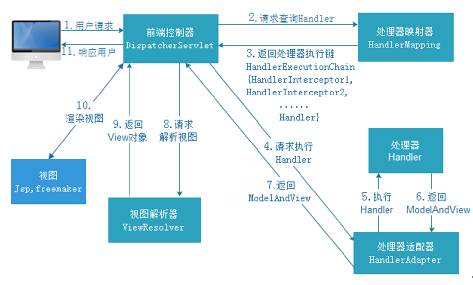

# SPRINGMVC

[TOC]

### 入门案例(注解方式)

###### 配置前端控制器

```xml
<web-app>
    <!-- springmvc的核心就是前端控制器，它本身给是一个servlet，所以需要在web.xml中进行配置 -->
	<servlet>
    	<servlet-name>springmvc</servlet-name>
        <servlet-class>org.springframework.web.servlet.DispatcherServlet</servlet-class>
        <!-- 不配置默认找/WEB-INF/[servlet名称]-servlet.xml -->
        <init-param>
        	<param-name>contextConfigLocation</param-name>
            <param-value>classpath:springmvc.xml</param-value>
        </init-param>
    </servlet>
    <servlet-mapping>
    	<servlet-name>springmvc</servlet-name>
        <!--
            /*	过滤所有文件
            *.do	过滤以 .do 结尾的所有请求
            /	过滤除 jsp 以外的所有文件（本人有疑问？）
        -->
        <url-pattern>*.action</url-pattern>
    </servlet-mapping>
</web-app>
```

###### 配置 springmvc.xml

```xml
<!-- 就是spring的配置文件 -->
<!-- 需要导入约束，这里没有导入 -->
<beans>
    <!-- 开启使用组件扫描器，省去在spring容器中配置每个Controller类 -->
    <!-- 配置controller扫描包，多个包用逗号分隔 -->
	<context:component-scan base-package="com.project.controller"></context:component-scan>
</beans>
```

###### 书写 controller 类

```java
//表示这是一个 Controller 类
@Controller
public class BookController {
    @RequestMapping(value="/book/showbooks.action")
    public ModelAndView showBooks() {
        List<Books> books = new ArrayList<Books>();
        ModelAndView mad = new ModelAndView();
        //类似于request.setAttribute("bookList",books)
        mad.addObject("bookList",books);
        //类似于请求转发
        mad.setViewName("/WEB-INF/book.jsp");
        return mad;
    }
}
```

入门案例配置方式

```xml
<!-- 配置处理器映射器 -->
<bean class="org.springframework.web.servlet.handler.BeanNameUrlHandlerMapping"></bean>
<!-- 配置方式二，简单url映射，集中配置bean的id对应的url,这种方式的controller需要实现HttpRequestHandler接口，类似于传统servlet开发 -->
<bean class="org.springframework.web.servlet.handler.SimpleUrlHandlerMapping">
    <property name="mappings">
        <props>
            <prop key="/addUser.do">UserController</prop>
            <prop key="/addTeacher.do">TeacherController</prop>
        </props>
    </property>
</bean>
<!-- 配置处理器适配器 -->
<bean class="org.springframework.web.servlet.mvc.SimpleControllerHandlerAdapter"></bean>
<!-- 配置方式二的处理器适配器 -->
<bean class="org.springframework.web.servlet.mvc.method.annotation.HttpRequestHnadlerAdapter"></bean>
<!-- 配置视图解析器 -->
<bean class="org.springframework.web.servlet.view.InternalResourceViewResolver"></bean>
<!-- 配置controller,这种方式的controller需要实现Controller接口 -->
<bean name="/addUser.do" class="org.project.controller.UserController"></bean>
```

### springmvc 架构



###### 架构流程

请求---->DispatcherServlet---->HandlerMapping---->根据 url 返回包名+类名+方法名---->Dispatcherservlet

---->HandlerAdapter---->调用 Handler(后端控制器)---->返回 ModelAndView---->HandlerAdapter---->

DispatcherServlet---->ViewResolver---->DispatcherServlet---->Jsp, freemaker

###### 架构组件

前端控制器：DispatcherServlet，springmvc 框架流程控制的中心

三大组件：

> HandlerMapping: 它负责根据用户请求 url 找到 Handler 即处理器，springmvc 提供了不同的映射器实现不同的映射方式，例如：配置文件方式，实现接口方式，注解方式等
>
> HandlerAdapter: 通过它对处理器进行执行，这是适配器模式的应用，通过扩展适配器可以对更多类型的处理器进行执行
>
> ViewResolver: 负责将处理结果生成 View 视图，它首先根据逻辑视图名解析成物理视图名即具体的页面地址，再生成 View 视图对象，最后对 View 进行渲染将处理结果通过页面展示给用户

用户开发组件：

> Handler: Handler 是继 DispatcherServlet 前端控制器的后端控制器，在 DispatcherServlet 的控制下 Handler 对具体的用户请求进行处理，由于 Handler 涉及到具体的用户业务请求，所以一般情况需要程序员根据业务需求开发 Handler
>
> View: springmvc 框架提供了很多的 View 视图类型的支持，包括：jstlView、freemarkerView、pdfView 等，我们最常用的视图就是jsp，一般情况下需要通过页面标签或页面模版技术将模型数据通过页面展示给用户，需要由程序员根据业务需求开发具体的页面

###### 默认加载组件

如果我们没有进行配置，框架将会加载默认的配件，它们定义在 DispatcherServlet.properties 中

由于默认注解处理器映射器和处理器适配器已经废弃，我们可以自己进行配置使用最新的组件

```xml
<!-- 配置处理器映射器 -->
<bean class="org.springframework.web.servlet.mvc.method.annotation.RequestMappingHandlerMapping"></bean>
<!-- 配置处理器适配器 -->
<bean class="org.springframework.web.servlet.mvc.method.annotation.RequestMappingHandlerAdapter"></bean>
```

直接配置处理器映射器和处理器适配器比较麻烦，可以采用注解驱动来加载

```xml
<mvc:annotation-driven />
```

可以配置视图解析器，简化返回地址的书写

```xml
<!-- 此视图解析器支持JSP视图解析，是框架的默认配置，我们为了属性所以自己再进行配置 -->
<bean class="org.springframework.web.servlet.view.InternalResourceViewResolver">
    <!-- 配置逻辑视图的前缀 -->
    <property name="prefix" value="/WEB-INF/JSP/"></property>
    <!-- 配置逻辑视图的后缀 -->
    <property name="suffix" value=".jsp"></property>
</bean>
```

### springmvc-spring-mybatis 整合

### 参数绑定

###### 默认支持的参数类型

HttpServletRequest

HttpServletResponse

HttpSession

Model: 除了 ModelAndView 以外，还可以使用 Model 来向页面传递数据，Model 是一个接口，在参数里直接声明 model 即可，如果使用 Model 则可以不使用 ModelAndView 对象，Model 对象可以向页面传递数据，View 对象则可以使用 String 返回值替代，不管是 Model 还是 ModelAndView，其本质都是使用 Request对象向 jsp 传递数据。

```java
public String queryBookById(HttpServletRequest request, Model model) {
    String id = request.getParameter("id");
    Book book = this.bookService.queryBookById(Integer.parseInt(id));
    //使用 model 传递数据
    model.addAttribute("book", book);
    //返回jsp页面，前后缀已配置在视图解析器
    return "book";
}
```

ModelMap: ModelMap 是 Model 接口的实现类，也可以通过 ModelMap 向页面传递数据，使用 Model 和 ModelMap 的效果一样，如果直接使用 Model，springmvc 会实例化 ModelMap

###### 绑定简单类型

当请求的参数名称和处理器形参名称一致时会将请求参数与形参进行绑定，支持的数据类型有

> 整形：Integer、int
>
> 字符串：String
>
> 单精度：Float、float
>
> 双精度：Double、double
>
> 布尔型：Boolean、boolean	对于布尔类型的参数，请求的参数值为 true 或 false，或者1或0

也可使用 @RequestParam 用于处理简单类型的绑定

```java
public String queryById(@RequestParam(value="id",required=true,dafaultValue="1") Integer id, ModelMap model){...}
```

###### 绑定 POJO 类型

提交的参数很多，或者提交的表单中的内容很多的时候，可以使用简单类型接受数据,也可以使用 pojo 接收数据，若使用 POJO 则要求 pojo 对象中的属性名和表单中 input 的 name 属性一致

```java
public String queryById(Book book, ModelMap model){...}
```

POST 提交参数乱码问题解决

```xml
<!-- 可以解决 post 请求的乱码问题
    get 请求乱码解决：
        1.修改tomcat配置文件，<Connector URLEncoding="UTF-8"...
        2.对参数重新进行编码，new String(str.getBytes("ISO8859-1"),"UTF-8")
-->
<filter>
    <filter-name>encoding</filter-name>
    <filter-class>org.springframework.web.filter.CharacterEncodingFilter</filter-class>
    <!-- 设置编码参数为 UTF8 -->
    <init-param>
        <param-name>encoding</param-name>
        <param-value>UTF-8</param-value>
    </init-param>
</filter>
<filter-mapping>
    <filter-name>encoding</filter-name>
    <!--不能配置为 / -->
    <url-pattern>/*</url-pattern>
</filter-mapping>
```

###### 绑定包装 POJO

将 input 表单参数的 name 属性设置为 `object.attribute`

```java
public class QueryVo {
    private Book book;
    //setter/getter...
}
```

```html
<!--  使用包装类持有对象 . 属性名为 input 标签 name 属性值-->
<input name="book.name">
```

###### 自定义参数绑定

由于日期数据有很多种格式，springmvc 没办法把字符串转换成日期类型，所以需要自定义参数绑定，前端控制器接收到请求后，找到注解形式的处理器适配器，对 RequestMapping 标记的方法进行适配，并对方法中的形参进行参数绑定，可以在 springmvc 处理器适配器上自定义转换器 Converter 进行参数绑定，一般使用`<mvc:annotation-driven/>` 注解驱动加载处理器适配器，可以在此标签上进行配置

自定义 Converter

```java
public class DateConverter implements Converter<String, Date> {
    @Override
    public Date convert(String source) {
        try {
            DateFormat format = new SimpleDateFormat("yy:MM:dd HH:mm:ss");
            Date date = format.parse(source);
            return date;
        } catch (ParseException e) {
            e.printStackTrace();
        }
        return null;
    }
}
```

配置 Converter

可以使用纯 xml 配置 Converter， 需要独立配置处理器映射器、适配器，要使用到`ConfigurableWebBindingInitializer`，它需要注入转换工厂，再将它注入适配器，以下使用注解驱动方式配置

```xml
<!-- 配置注解驱动 -->
<mvc:annotation-driven conversion-service="conversionService" />
<!-- 配置转换器 -->
<bean id="conversionService" class="org.springframework.format.support.FormattingConversionServiceFactoryBean">
    <property name="converters">
        <!-- 可以使用array,list,set... -->
        <list>
            <!-- 可以配置多个转换器，如时间转换器、去前后空字符转换器... -->
            <bean class="com.project.converter.DateConverter" />
        </list>
    </property>
</bean>
```

设置日期转换格式的另一种方式

```java
//在controller中重写以下方法
@InitBinder
public void initBinder(WebDataBinder binder) {
    SimpleDateFormat format = new SimpleDateFormat("yyyy-MM-dd");
    //是否严格解析日期
    format.setLenient(false);
    binder.registerCustomEditor(Date.class, new CustomDateEditor(format, true));
}
```

###### 高级参数绑定

数组类型：controller 方法中可以接受数组参数，或者 POJO 对象中的数组属性

List 类型：接收 List 类型的数据必须是 POJO 的属性，如果方法的形参为 ArrayList 类型无法正确接收到数据；input 标签的 name 属性必须为 `list属性名+下标+元素属性` 

*自我提问：Set 类型如何绑定? Map 类型如何绑定?*

### springmvc 与 strust2 区别

springmvc 的入口是一个 servlet 即前端控制器，而 struts2 入口是一个 filter 过滤器

springmvc 是基于方法开发(一个url对应一个方法)，请求参数传递到方法的形参，可以设计为单例(多线程，为每个请求创建方法副本)或多例(创建类的副本，建议单例)，struts2 是基于类开发，传递参数是通过类的属性，只能设计为多例

Struts 采用值栈存储请求和响应的数据，通过 OGNL 存取数据， springmvc 通过参数解析器是将 request 请求内容解析，并给方法形参赋值，将数据和视图封装成 ModelAndView 对象，最后又将 ModelAndView 中的模型数据通过 request 域传输到页面，Jsp 视图解析器默认使用 jstl


### @RequestMapping 

此注解的 value 值为一个数组，即可以将多个 url 映射到同一个方法

可以添加在类上，限定类下的所有方法请求 url 的请求前缀

```java
@RequestMapping("/user")
public class UserController{...}
```

请求方法限定，可以对 url 设置限定请求进来的方法

```java
//限定请求方式为GET, 此时如果通过Post方式访问则会报错
@RequestMapping(value="/findUser.do",method=RequestMethod.GET)
//@RequestMapping(method={RequestMethod.GET, RequestMethod.POST})
public ModelAndView findUser(){...}
```


### Controller 方法返回值

###### 返回 ModelAndView 对象

方法中定义 ModelAndView 对象并返回，对象中可以添加 model 数据、指定 view

###### 返回 void

使用 request、response 指定响应结果，例如转发、重定向、发送 json 数据

###### 返回字符串

请求转发

```java
return "forward:/user.jsp"
```

重定向

```java
return "redirect:/user.jsp"
```


### 异常处理器

系统中异常包括两类：预期异常和运行时异常 RuntimeException，前者通过捕获异常从而获取异常信息，后者主要通过规范代码开发、测试通过手段减少运行时异常的发生

系统的 dao、service、controller 出现都通过 throws Exception 向上抛出，最后由 springmvc 前端控制器交由异常处理器进行异常处理；为了区别不同的异常，通常根据异常类型进行区分，我们创建一个自定义系统异常，如果 controller、service、dao 抛出此类异常说明是系统预期处理的异常信息

```java
//自定义异常
public class MyException extends Exception {
    //异常信息
    public String message;
    public MyException() {}
    public MyException(String message) {this.message = message;}
    public String getMessage(){return message;}
    public void SetMessage(String message) {this.message = message};
}
```

自定义异常处理器

```java
public class CustomHandlerException implements HandlerExceptionResolver {
    //handler发生异常的地方，包名+类名+方法名（形参）
    public ModelAndView resolveException(HttpServletRequest request, HttpServletResponse response, Object handler, Exception exception) {
        //定义异常信息
        String msg;
        //判断异常类型
        if(exception instanceof MyException) {
            //如果是自定义异常，获得异常信息
            msg = exception.getMessage();
        } else {
            //如果是运行时异常，则取错误堆栈，从堆栈中获取异常信息
            Writer out = new StringWriter();
            PrintWriter s = new PrintWriter(out);
            exception.printStackTrace(s);
            msg = out.toString();
        }
        
        //把错误信息发给相关人员，邮件，短信等
        
        //返回错误页面，给用户友好页面显示错误信息
        ModelAndView model = new ModelAndView();
        model.addObject("msg",msg);
        model.setViewName("error.jsp");
        return model;
    }
}
```

###### 异常处理器配置

```xml
<!-- 配置全局异常处理器 -->
<bean id="customHandlerException" class="com.project.exception.CustomHandlerException"></bean>
```


### 图片上传

###### 上传图片需要的 jar 包

> commons-fileupload.jar
>
> commons-io.jar

###### 配置上传解析器

```xml
<!-- MultipartFile为一个接口，需要再容器中配置实现类 -->
<!-- 文件上传实现类，id必须设置为multipartResolver，spring靠名字找到此实现类 -->
<bean id="multipartResolver" class="org.springframework.web.multipart.commons.CommonsMultipartResolver">
    <!-- 设置文件上传大小 -->
    <property name="maxUploadSize" value="500000"></property>
</bean>
```

###### 页面确认

上传图片表单必须添加 enctype 属性

```html
<!-- 设置数据以二进制格式传输 -->
<form enctype="multipart/form-data"></form>
```

###### 图片上传逻辑

```java
//更新商品图片逻辑
@RequestMapping("/update.do")
public String updateProductById(Product product, MultipartFile pictureFile) throws Exception {
    //设置图片名称，不能重复，使用 UUID
    String picName = UUID.randomUUID().toString();
    //获取文件名
    String oriName = pictureFile.getOriginalFilename();
    //获取图片后缀	FileUtils.extension(oriname);---->jpg
    String extName = oriName.subString(oriName.lastIndexOf("."));
    
    //开始上传
    pictureFile.transferTo(new File("C:/upload/image"+picName+extName));
    
    //设置图片名到商品
    product.setPicture(picName+extName);
    //更新商品
    this.productService.updateProductById(product);
    return "forward:productEdit.action";
}
```

###### 可以在 tomcat 上配置虚拟目录

修改 server.xml 配置文件，也可在 eclipse 中配置

```xml
<!-- 访问 http://localhost:8080/pic 即可访问 C:\upload\image -->
<context docBase="C:\upload\image" path="/pic" reloadable="false" />
```


### JSON 数据交互

###### @RequestBody

此注解用于读取 http 请求(字符串)的内容，通过 HttpMessageConverter 接口将读取到的内容(JSON)转换为 java 对象并绑定到 controller 方法的参数上

以前的参数格式 `?name=zhangsan&password=123`

现在的参数格式

```json
{
    name: zhangsan,
    password: 123
}
```

###### @ResponseBody

此注解用于将 controller 方法的返回对象，通过 HttpMessageConverter 接口转换为指定格式的数据，如 json、xml 等，通过 response 响应给客户

###### 配置 JSON 转换器

如果未使用注解驱动，则需要给处理器适配器配置 json 转换器

```xml
<bean class="org.springframework.web.servlet.mvc.method.annotation.RequestMappingHandlerAdapter">
    <property name="messageConverters">
        <list>
            <bean class="org.springframework.http.converter.json.MappingJackson2HttpMessageConverter"></bean>
        </list>
    </property>
</bean>
```


### RESTful 

Restful 就是一个资源定位及资源操作的风格，不是标准也不是协议，只是一种风格，基于这个风格设计的软件可以更简洁，更有层次，更易于实现缓存等机制

资源：互联网所有的事物都可以被抽象为资源

资源操作：使用 POST、DELETE、PUT、GET，使用不同方法对资源进行操作，分别对应添加、 删除、修改、查询

传统操作：

> `http://127.0.0.1/item/queryItem.action?id=1`     查询GET
>
> `http://127.0.0.1/item/saveItem.action`               新增POST
>
> `http://127.0.0.1/item/updateItem.action`           更新POST
>
> `http://127.0.0.1/item/deleteItem.action?id=1`    删除GET或POST

使用 Restful 操作资源

> `http://127.0.0.1/item/1`           查询GET
>
> `http://127.0.0.1/item`        新增POST
>
> `http://127.0.0.1/item`        更新PUT
>
> `http://127.0.0.1/item/1`           删除DELETE

使用 RESTful 风格开发根据 id 查询商品的接口，请求地址为 `http:127.0.0.1/product/1`

```java
@RequestMapping("product/{id}")
//@ResponseBody
public @ResponseBody Product queryProductById(@PathVaribale("id") Integer id) {...}
```


### 拦截器

springmvc 中的处理器拦截器与 filter 类似，用于对处理器进行预处理和后处理

###### 定义拦截器

```java
public class HandlerInterceptor1 implements HandlerInterceptor {
    //controller执行并返回视图后调用，可以得到执行controller时的异常信息，记录操作日志等
    public void afterCompletion(){...}
    //controller执行未返回视图前调用，可以在返回用户前对模型数据进行加工处理
    public void postHandler() {...}
    //controller执行前调用，返回true继续执行，返回false中止执行，可以进行登录校验、权限拦截等
    public boolean preHandler() {...}
}
```

###### 配置拦截器

```xml
<mvc:interceptors>
    <mvc:interceptor>
        <!-- 所有的请求都进入拦截器 -->
        <mvc:mapping path="/**"></mvc:mapping>
        <!-- 具体的拦截器 -->
        <bean class="com.project.intercaptor.HandlerInterceptor1"></bean>
    </mvc:interceptor>
    <mvc:interceptor>...</mvc:interceptor>
</mvc:interceptors>
```

拦截器执行顺序

> preHandler 按拦截器定义顺序调用
>
> postHandler 按拦截器定义逆序调用
>
> afterCompletion 按拦截器定义逆序调用

postHandler 在拦截器链内所有拦截器返回成功调用，afterCompletion 只有 preHandler 返回 true 才调用

