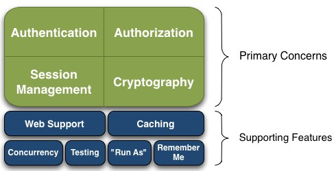
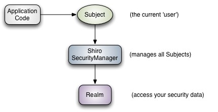
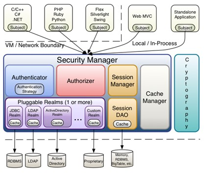
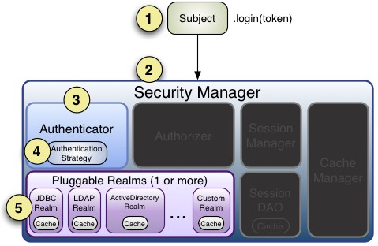
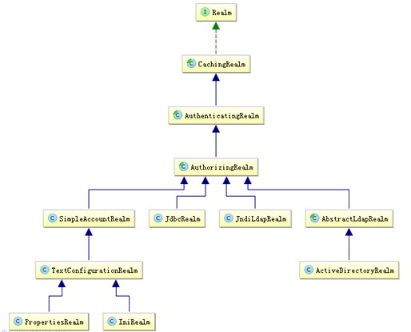
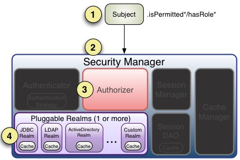

# Shiro 

### 简介

Apache Shiro 是 Java 的一个安全框架，它相当简单，功能不如 Spring Security 强大，但是在实际工作时可能并不需要那么复杂的东西，所以使用小而简单的Shiro就足够了

Shiro 可以非常容易的开发出足够好的应用，其不仅可以用在 JavaSE 环境，也可以用在 JavaEE 环境。Shiro可以帮助我们完成：认证、授权、加密、会话管理、与 Web 集成、缓存等

###### 基本功能点：



**Authentication：**身份认证/登录，验证用户是不是拥有相应的身份；
**Authorization：**授权，即权限验证，验证某个已认证的用户是否拥有某个权限；即判断用户是否能做事情，常见的如：验证某个用户是否拥有某个角色。或者细粒度的验证某个用户对某个资源是否具有某个权限；
**Session Manager：**会话管理，即用户登录后就是一次会话，在没有退出之前，它的所有信息都在会话中；会话可以是普通 JavaSE 环境的，也可以是 Web 环境的；
**Cryptography：**加密，保护数据的安全性，如密码加密存储到数据库，而不是明文存储；
**Web Support：**Web支持，可以非常容易的集成到Web环境；
**Caching：**缓存，比如用户登录后，其用户信息、拥有的角色/权限不必每次去查，这样可以提高效率；
**Concurrency：**shiro支持多线程应用的并发验证，即如在一个线程中开启另一个线程，能把权限自动传播过去；
**Testing：**提供测试支持；
**Run As：**允许一个用户假装为另一个用户（如果他们允许）的身份进行访问；
**Remember Me：**记住我，这个是非常常见的功能，即一次登录后，下次再来的话不用登录了
**Shiro不会去维护用户、维护权限；这些需要我们自己去设计/提供；然后通过相应的接口注入给Shiro即可**

###### shiro 外部结构



> Subject：主体，代表当前用户
>
> SecurityManager：安全管理器，shiro 核心
>
> Realm：域，shiro 从 Realm 获取安全数据

###### shiro 内部结构



> Subject：主体
>
> SecurityManager：shiro 的核心
>
> Authenticator：认证器
>
> Authizer：授权器
>
> Realm：域，可以有一个或多个，安全实体数据源
>
> SessionManager：管理 session 的生命周期的组件，shiro 抽象了的自己的 session 来管理主体与应用之间交互的数据
>
> SessionDAO：数据访问对象，我们可以实现自己的 SessionDAO
>
> CacheManager：缓存控制器，管理如用户、角色、权限等的缓存
>
> Crytography：密码模块，Shiro 提高了一些常见的加密组件用于如密码加密/解密的


### 身份验证

**身份验证：**即在应用中谁能证明他就是他本人。一般提供如他们的身份ID一些标识信息来表明他就是他本人，如提供身份证，用户名/密码来证明。

在shiro中，用户需要提供 principals （身份）和 credentials（证明）给 shiro，从而应用能验证用户身份

**principals：**身份，即主体的标识属性，可以是任何东西，如用户名、邮箱等，唯一即可。一个主体可以有多个principals，但只有一个Primary principals，一般是用户名/密码/手机号。

**credentials：**证明/凭证，即只有主体知道的安全值，如密码/数字证书等。

最常见的 principals 和 credentials 组合就是用户名/密码了

###### 身份认证流程



```java
//使用 shiro 进行身份验证，登入/登出
public void test() {
    //获取SecurityManager工厂
    Factory<org.apache.shiro.mgt.SecurityManager> factory = new IniSecurityManageFactory("classpath:shiro.ini");
    //得到SecurityManager实例，并绑定到SecurityUtils
    org.apache.shiro.mgt.SecurityManager securityManager = fatory.getInstance();
    SecurityUtils.setSecurityManager(securityManager);
    //获得Subject，并创建用户名密码身份验证Token
    Subject subject = SecurityUtils.getSubject();
    UsernamePasswordToken token = new UsernamePasswordToken("zhang","123");
    
    try{
        //登录，身份验证
    	subject.login(token);    
    }catch(AuthenticationException e) {
        //身份验证失败
    }
    
    //断言用户已经登录
    Assert.assertEquals(true, subject.isAuthenticated());
    
    //退出
    subject.logout();
}
```

```ini
#shiro.ini
[users]
zhang=123
```


###### 单 Realm 配置 

```java
public class MyRealm implements Realm {
    public String getName() {
        return "MyRealm";
    }
    public boolean supports(AuthenticationToken token) {
        //仅支持UsernamePasswordToken类型的Token
        return token instanceof UsernamePasswordToken;
    }
    public AuthenticationInfo getAuthenticationInfo(AuthenticationToken token) throws AuthenticationException {
        //得到用户名
        String username = (String)token.getPrincipal();
        //得到密码
        String password = new String((char[])token.getCredentials());
        //用户名错误
        if(!"zhang".equals(username)) {
            throw new UnknownAccountException();
        }
        //密码错误
        if(!"password".equals(password)) {
            throw new IncorrentCredentialsException();
        }
        //如果身份验证成功，返回一个AuthenticationInfo实例
        return new SimpleAuthenticationInfo(username,password,getName());
    }
}
```

```ini
#shiro-realm.ini
#声明一个realm
myRealm=com.project.shiro.MyRealm
#指定securityManager的realms实现
securityManager.realms=$myRealm
```


###### 多 Realm 配置

```ini
#shiro-multi-realm.ini
#声明一个realm
myRealm1=com.project.shiro.MyRealm1
myRealm2=com.project.shiro.MyRealm2
#指定securityManager的realms实现
securityManager.realms=$myRealm1,$myRealm2
```


###### Shiro 默认提供的 Realm



以后一般继承 AuthorizingRealm（授权）即可；其继承了 AuthenticatingRealm（即身份验证），而且也间接继承了 CachingRealm（带有缓存实现）

realm 主要默认实现：

> IniRealm: [users], [roles]
>
> PropertiesRealm: user.username=password,role1; role.role1=permission1
>
> JdbcRealm: users, user_roles, roles_permissions


###### JDBC Realm 使用

```ini
#shiro-jdbc-realm.ini
#变量名=全限定类名会自动创建一个类实例
jdbcRealm=org.apache.shiro.realm.jdbc.JdbcRealm  
dataSource=com.alibaba.druid.pool.DruidDataSource
#变量名.属性=值 自动调用相应的setter方法进行赋值
dataSource.driverClassName=com.mysql.jdbc.Driver  
dataSource.url=jdbc:mysql://localhost:3306/shiro  
dataSource.username=root  
#dataSource.password=
#$变量名 引用之前的一个对象实例
jdbcRealm.dataSource=$dataSource  
securityManager.realms=$jdbcRealm
```

###### Authenticator 及 AuthenticationStrategy

Authenticator 的职责是验证用户帐号，是 Shiro API 中身份验证核心的入口点

如果验证成功，将返回 AuthenticationInfo 验证信息；此信息中包含了身份及凭证；如果验证失败将抛出相应的 AuthenticationException 实现

SecurityManager 接口继承了 Authenticator，另外还有一个 ModularRealmAuthenticator 实现，其委托给多个 Realm 进行验证，验证规则通过 AuthenticationStrategy 接口指定，默认提供的实现：FirstSuccessfulStrategy、AtLeastOneSuccessfulStrategy(默认使用)、AllSuccessfulStrategy


### 授权

授权，也叫访问控制，即在应用中控制谁能访问哪些资源（如访问页面/编辑数据/页面操作等），基于 RBAC

> 主体：访问应用的用户，shiro 中即 subject
>
> 资源：用户可以访问的任何东西
>
> 权限：用户有没有操作某个资源的权利，需要把权限赋予给用户，Shiro支持粗粒度权限（如用户模块的所有权限）和细粒度权限（操作某个用户的权限，即实例级别的）
>
> 角色：操作集合，可以理解为权限的集合，通常我们会赋予用户角色而不是权限
>
> 隐式角色：通过角色来验证用户有没有操作权限，粒度是以角色为单位进行访问控制的，粒度较粗
>
> 显示角色：通过权限控制谁能访问某个资源，粒度是以资源/实例为单位的，粒度较细


###### 授权方式

编程式：通过写if/else授权代码块完成

```java
Subject subject = SecurityUtils.getSubject();
if(subject.hasRole("admin")) {
    //有权限
}else{
    //无权限
}
```

注解式：通过在执行的Java方法上放置相应的注解完成，没有权限将抛出相应的异常

```java
@RequiresRoles("admin")
public void hello(){
    //有权限
}
```

JSP/GSP标签：在JSP/GSP页面通过相应的标签完成

```jsp
<shiro:hasRole name="admin">  
<!— 有权限 —>  
</shiro:hasRole>   
```


###### 授权

基于角色的访问控制

```ini
[users]
zhangsan=123,roles
#Shiro提供了hasRole/hasRole用于判断用户是否拥有某个角色/某些权限，Shiro提供的checkRole/checkRoles和hasRole/hasAllRoles不同的地方是它在判断为假的情况下会抛出UnauthorizedException异常
```

基于资源的访问控制

```ini
[users]
zhang=123,role1,role2
[roles]
role1=user:create,user:update
role2=user:create,delete
#Shiro提供了isPermitted和isPermittedAll用于判断用户是否拥有某个权限或所有权限,Shiro提供的checkPermission/checkPermissions和isPermitted/isPermittedAll不同的地方是它在判断为假的情况下会抛出UnauthorizedException异常
```

Permisssion

规则：“资源标识符：操作：对象实例ID”，即对哪个资源的哪个实例可以进行什么操作。其默认支持通配符权限字符串，“:”表示资源/操作/实例的分割；“,”表示操作的分割；“*”表示任意资源/操作/实例

性能问题：通配符匹配方式比字符串相等匹配来说是更复杂的，因此需要花费更长时间，但是一般系统的权限不会太多，且可以配合缓存来提供其性能，如果这样性能还达不到要求我们可以实现位操作算法实现性能更好的权限匹配。另外实例级别的权限验证如果数据量太大也不建议使用，可能造成查询权限及匹配变慢。可以考虑比如在sql查询时加上权限字符串之类的方式在查询时就完成了权限匹配


###### 授权流程



Authorizer、PermissionResolver及RolePermissionResolver

Authorizer 的职责是进行授权（访问控制），是 Shiro API 中授权核心的入口点，其提供了相应的角色/权限判断接口；SecurityManager 继承了 Authorizer 接口，且提供了 ModularRealmAuthorizer 用于多 Realm 时的授权匹配； PermissionResolver 用于解析权限字符串到 Permission 实例，而 RolePermissionResolver 用于根据角色解析相应的权限集合


### INI 配置

###### 根对象 SecurityManager

Shiro 是从根对象 SecurityManager 进行身份验证和授权的，即所有操作都是自它开始的，这个对象是线程安全且整个应用只需要一个即可，因此 Shiro 提供了 SecurityUtils 让我们绑定它为全局的，方便后续操作

###### INI 配置

```ini
[main]  
#提供了对根对象securityManager及其依赖的配置  
securityManager=org.apache.shiro.mgt.DefaultSecurityManager  
…………  
securityManager.realms=$jdbcRealm  
  
[users]  
#提供了对用户/密码及其角色的配置，用户名=密码，角色1，角色2  
username=password,role1,role2  
  
[roles]  
#提供了角色及权限之间关系的配置，角色=权限1，权限2  
role1=permission1,permission2  
  
[urls]  
#用于web，提供了对web url拦截相关的配置，url=拦截器[参数]，拦截器  
/index.html = anon  
/admin/** = authc, roles[admin], perms["permission1"]  
```


### 编码/加密

###### 编码/解码

Shiro 提供了 base64 和 16 进制字符串编码/解码的API支持，方便一些编码解码操作

```java
//base64编码解码
String str = "hello";
String base64Encoded = Base64.encodeToString(str.getBytes());
String str2 = Base64.decodeToString(base64Encoded);  
Assert.assertEquals(str, str2); 

//16进制编码解码
String str = "hello";  
String base64Encoded = Hex.encodeToString(str.getBytes());  
String str2 = new String(Hex.decode(base64Encoded.getBytes()));  
Assert.assertEquals(str, str2);   
```

###### 散列算法

散列算法一般用于生成数据的摘要信息，是一种不可逆的算法，一般适合存储密码之类的数据，常见的散列算法如 MD5、SHA 等，一般进行散列时最好提供一个 salt


### web 集成

Shiro 提供了与 Web 集成的支持，其通过一个 ShiroFilter 入口来拦截需要安全控制的 URL，然后进行相应的控制，ShiroFilter 类似于如 Strut2/SpringMVC 这种 web 框架的前端控制器，其是安全控制的入口点，其负责读取配置（如ini配置文件），然后判断URL是否需要登录/权限等工作

###### ShiroFilter 入口

与 spring 集成的方式

```xml
<filter>  
    <filter-name>shiroFilter</filter-name>  
    <filter-class>org.springframework.web.filter.DelegatingFilterProxy</filter-class>  
    <init-param>  
        <param-name>targetFilterLifecycle</param-name>  
        <param-value>true</param-value>  
    </init-param>  
</filter>  
<filter-mapping>  
    <filter-name>shiroFilter</filter-name>  
    <url-pattern>/*</url-pattern>  
</filter-mapping>
```

DelegatingFilterProxy 作用是自动到 spring 容器查找名字为 shiroFilter（filter-name）的 bean 并把所有 Filter 的操作委托给它。然后将 ShiroFilter 配置到 spring 容器即可

```xml
<bean id="shiroFilter" class="org.apache.shiro.spring.web.ShiroFilterFactoryBean"> 
    <property name="securityManager" ref="securityManager"/>  
     ...
</bean>
```


### JSP 标签

Shiro 提供了JSTL 标签用于在 JSP/GSP 页面进行权限控制，如根据登录用户显示相应的页面按钮

```jsp
<%@taglib prefix="shiro" uri="http://shiro.apache.org/tags" %>
<shiro:guest>欢迎游客登录，<a>登录</a></shiro:guest>
<shiro:user>欢迎[<shiro:principal/>]，<a>退出</a></shiro:user>

<shiro:authenticated>身份验证通过</shiro:authenticated>
<shiro:notAuthenticated>未身份验证（包括记住我）</shiro:notAuthenticated>

<shiro:principal/>

<shiro:hasRole name="admin"></shiro:hasRole>
<shiro:hasAnyRoles name="admin,user"></shiro:hasAnyRoles>
<shiro:lacksRole name="user"></shiro:lacksRole>

<shiro:hasPermission name="user:create"></shiro:hasPermission>
<shiro:lacksPermission name="user:delete"></shiro:lacksPermission>
```


### 会话管理

Shiro 提供了完整的企业级会话管理功能，不依赖于底层容器（如web容器tomcat），不管 JavaSE 还是 JavaEE 环境都可以使用，提供了会话管理、会话事件监听、会话存储/持久化、容器无关的集群、失效/过期支持、对 Web 的透明支持、SSO 单点登录的支持等特性。

###### 常用API

```java
public void showApi() {
    //获取session，默认情况下如果启用会话存储功能的话在创建Subject时会主动创建一个Session
    Session session = subject.getSession();
    Session session = subject.getSession(false);
    
    session.getId();
    
    //获得/设置session过期时间，默认为会话管理器的全局过期时间
    session.getTimeout();
    session.setTimeout();
    
    //获取会话的启动时间及最后的访问时间
    session.getStartTimestamp();
    session.getLastAccessTime();
    
    //更新会话最后访问时间及销毁会话，Subject.logout()和javax.servlet.http.HttpSession.invalidate()会自动调用stop方法来销毁shiro会话
    session.touch();
    session.stop();
    
    session.setAttribute(String key,Object value);
    session.getAttribute(String key);
    session.removeAttribute(String key);
}
```

###### 会话管理器

会话管理器管理着应用中所有 Subject 的会话的创建、维护、删除、失效、验证等工作。是 Shiro 的核心组件，顶层组件 SecurityManager 直接继承了 SessionManager，且提供了 SessionsSecurityManager 实现直接把会话管理委托给相应的 SessionManager，DefaultSecurityManager 及 DefaultWebSecurityManager 默认 SecurityManager 都继承了 SessionsSecurityManager。

```java
public void testApi(){
    //SecurityManager提供的接口
    Session start(SessionContext context);	//启动会话
    Session getSession(SessionKey key) throws SessionException;	//根据会话Key获取会话
    
    //WebSessionManager提供的接口
    boolean isServletContainerSessions();	//是否使用Servlet容器的会话
    
    void ValidatingSessionManager();	//验证所有会话是否过期
}
```

shiro 提供了三个默认会话管理器实现

> DefaultSessionManager: DefaultSecurityManager使用的默认实现，用于JavaSE 环境
>
> ServletContainerSessionManager: DefaultWebSecurityManager使用的默认实现，用于Web环境，其直接使用Servlet 容器的会话
>
> DefaultWebSessionManager: 用于Web环境的实现，可以替代 ServletContainerSessionManager，自己维护着会话，直接废弃了 Servlet 容器的会话管理

###### 会话监听器

会话监听器用于监听会话创建、过期及停止事件

```java
//如果只想监听某一个事件，可以继承SessionListenerAdapter实现
public class MySessionListener1 implements SessionListener {
    @Override
    public void onStart(Session session) {//会话创建时触发
        System.out.println("会话创建：" + session.getId());
    }
    @Override
    public void onExpiration(Session session) {//会话过期时触发
        System.out.println("会话过期：" + session.getId());
    }
    @Override
    public void onStop(Session session) {//退出/会话过期时触发
        System.out.println("会话停止：" + session.getId());
    }
}
```

配置会话监听器

```ini
sessionListener1=com.project.listener.MySessionListener1
sessionListener2=com.project.listener.MySessionListener2
sessionManager.sessionListeners=$sessionListener1,$sessionListener2
```

###### 会话存储/持久化

Shiro提供SessionDAO用于会话的CRUD，即DAO（Data Access Object）模式实现

```java
//如DefaultSessionManager在创建完session后会调用该方法；如保存到关系数据库/文件系统/NoSQL数据库；即可以实现会话的持久化；返回会话ID；主要此处返回的ID.equals(session.getId())；  
Serializable create(Session session);  
//根据会话ID获取会话  
Session readSession(Serializable sessionId) throws UnknownSessionException;  
//更新会话；如更新会话最后访问时间/停止会话/设置超时时间/设置移除属性等会调用  
void update(Session session) throws UnknownSessionException;  
//删除会话；当会话过期/会话停止（如用户退出时）会调用  
void delete(Session session);  
//获取当前所有活跃用户，如果用户量多此方法影响性能  
Collection<Session> getActiveSessions();  
```


### 缓存机制

