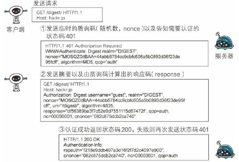

#### 网络基础

###### TCP/IP 分层管理

- 应用层

  向用户提供应用服务时通信的活动，如 FTP、DNS、HTTP

- 传输层

  提供处于网络连接中的两台计算机之间的数据传输，TCP、UDP

- 网络层

  处理在网络上流动的数据包（传输最小单位），IP

- 数据链路层

  处理连接网络的硬件部分

###### IP、TCP、DNS

- IP 网际协议

  把各种数据包传送给对方

  IP 地址：节点被分配到的地址，可变。IP 间的通信依赖 MAC 地址

  MAC 地址：网卡所属的固定地址，不可变

  ARP协议：根据通信方的 IP 地址反查出对应的 MAC 地址	

- TCP 协议

  提供可靠的字节流服务（将大数据分割成以报文段为单位的数据包进行管理）

  **三次握手**

  TCP 采用三次握手策略来确保数据传输的可靠性

  

- DNS 域名解析

  提供域名到 IP 地址间的解析服务，DNS 协议可通过域名查找 IP 地址，也可逆向从 IP 地址反查域名

- 访问过程

  

###### URI、URL(RFC)

- URI

  统一资源标识符，用字符串标识某一互联网资源

  

- URL

  统一资源定位符，标识资源的地点，是 URI 的子集

#### 简单的 HTTP 协议

###### http 是一种无状态协议

###### HTTP 方法

- GET	请求资源
- POST	传输实体主体
- PUT	传输文件，自身不带验证机制，存在安全性问题
- HEAD	获得报文首部，与 GET 方法一样，但不返回报文主体部分，用于验证 URI 的有效性及资源更新的日期时间等
- DELETE	删除文件，与 PUT 相反
- OPTIONS	询问支持的方法
- TRACE	追踪路径
- CONNECT	要求用隧道协议连接代理

###### 持久连接

早期的 HTTP 协议每进行一次 HTTP 通信就要断开一次 TCP 连接，随着请求资源的复杂化，这种方式需要极大的通信量开销

HTTP/1.1 提出了持久连接（keep-alive），只要任意一端没有明确提出断开连接，则保持 TCP 连接状态

持久连接减轻了服务器段的负载，并提高了页面的显示速度，HTTP/1.1 中所有的连接默认都是持久连接

**管线化**：多个请求并行发送（如一个 web 页面包含十张图片，管线化使得十张图片可以同时请求）

#### HTTP 报文内的 HTTP 信息

###### 请求报文/响应报文结构

###### 编码提升传输速率

- 报文主体、实体主体

  报文主体通常等于实体主体，传输中进行编码操作时，实体主体内容发生变化，与报文主体产生差异

- 内容编码

  指明应用在实体内容上的编码格式，并保持实体信息原样压缩

  常用内容编码：gzip、compress、deflate、identity(不进行编码)

- 分块传输编码

  通过把数据分割成多块，让浏览器能逐步显示页面

###### 发送多种数据的多部分对象集合

###### 获取部分内容的范围请求

###### 内容协商返回最合适的内容

#### 返回结果的 HTTP 状态码

当服务器断发送请求时，描述返回的请求结果

###### 状态码类别

- 2xx

  > 200 OK
  >
  > 204 No Content	响应报文不含实体的主体部分
  >
  > 206 Partial Content	范围请求，响应报文由 Content-Range 指定范围的实体内容

- 3xx

  > 301	永久性重定向
  >
  > 302	临时重定向
  >
  > 303	与 302 功能相同，但 303 明确表示客户端应使用 GET 方式获取资源
  >
  > 304	Not Modified
  >
  > 307

- 4xx

  > 400	Bad Request	请求错误
  >
  > 401	Unauthorized	发送的请求需要有通过 HTTP 认证的认证信息
  >
  > 403	Forbidden	拒绝访问
  >
  > 404	Not Found	请求资源不存在

- 5xx

  > 500	Internal Server Error	服务器端执行请求时发生错误
  >
  > 503	Service Unavailable	服务器处于超负载或正在停机维护

#### 与 HTTP 协作的 WEB 服务器

###### 通信数据转发程序：代理、网关、隧道

###### 缓存

- 缓存服务器
- 缓存的有效期限
- 客户端缓存

#### HTTP 首部

###### HTTP 首部字段类型

- 通用首部字段
- 请求首部字段
- 响应首部字段
- 实体首部字段

#### 确保 Web 安全的 HTTPS

HTTP 协议中可能存在信息窃听或身份伪装等安全问题，使用 HTTPS 通信机制可有效防止这些问题

###### HTTP 的缺点

- 通信使用明文（不加密），内容可能被窃听
- 不验证通信方的身份，可能遭遇伪装
- 无法证明报文的完整性，有可能已被篡改

###### 加密防止被窃听

- 通信加密

  HTTP 协议中没有加密机制，但可以通过和 SSL 或 TLS 组合使用，加密 HTTP 的通信内容。与 SSL 组合使用的 HTTP 被称为 HTTPS 

- 内容加密

  对参与通信的内容本身加密。

###### HTTPS = HTTP+加密+认证+完整性保护

- 共享密钥加密（对称密钥加密）
- 公开密钥加密（非对称密钥加密）

#### 确认访问用户身份的认证

###### 认证信息

密码、动态令牌、数字认证、生物认证、IC 卡等

###### 认证方式（HTTP/1.1）

- BASIC 认证

  

- DIGEST 认证

  

- SSL 客户端认证

- FormBase 认证

#### 基于 HTTP 的功能追加协议

#### 构建 Web 内容的技术

#### Web 的攻击技术